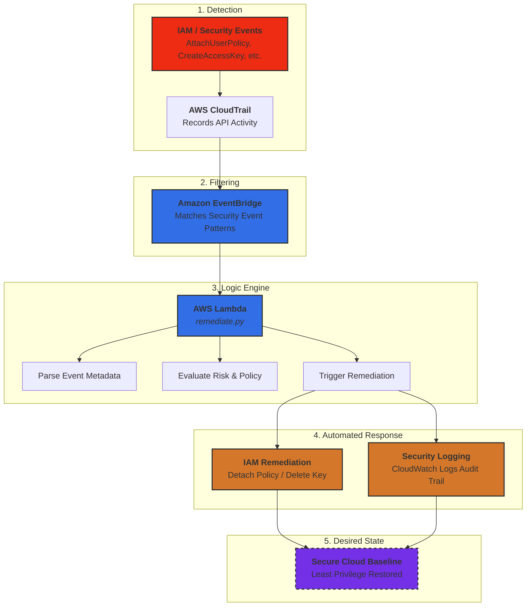
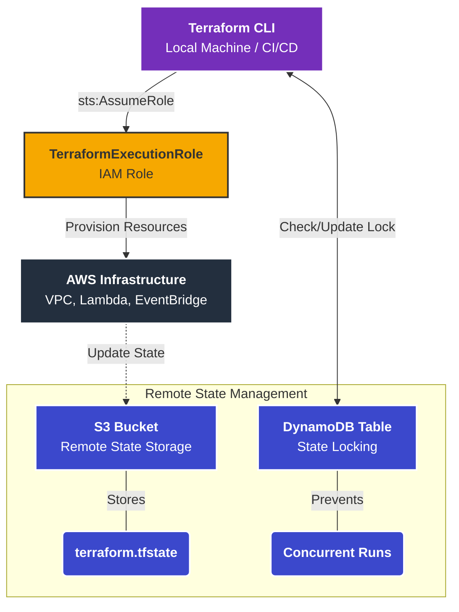

# Self-Healing Cloud Security Automation

**AWS | Terraform | IAM | EventBridge | Lambda | CloudTrail**

A cloud security engineering project demonstrating **event-driven security detection and automated remediation** using Terraform and AWS native services.

This project simulates how modern cloud environments detect IAM privilege escalation events and automatically restore **least-privilege access** without manual intervention.

---

# Project Overview

This project implements a **self-healing cloud security architecture** that detects and remediates unauthorized IAM policy changes in real time.

Instead of relying on manual incident response, the system:

- Monitors AWS API activity using CloudTrail  
- Detects security-relevant events using EventBridge  
- Triggers automated remediation using Lambda  
- Restores the environment to a secure baseline  

---

# Architecture Diagram

---

---

# Key Security Capabilities

## Event-Driven Threat Detection

The system monitors IAM-related API activity such as:

- AttachRolePolicy  
- PutUserPolicy  
- CreatePolicy  
- Privilege escalation attempts  

EventBridge filters these events in real time and triggers remediation workflows.

---

## Automated Privilege Remediation

The Lambda remediation engine:

- Parses incoming security events  
- Identifies unauthorized privilege changes  
- Removes overly permissive policies (e.g., `AdministratorAccess`)  
- Restores secure IAM configurations  

This creates a **self-healing identity security model**.

---

## Security Logging & Visibility

All remediation actions are logged to:

- **Amazon CloudWatch Logs**

This provides:

- Audit trail for security actions  
- Debugging capability  
- Operational visibility  

---

# Attack Simulation

To validate the system, the following scenario is tested:

1. A user or role is granted the **AdministratorAccess** policy  
2. CloudTrail records the IAM policy change  
3. EventBridge detects the security event  
4. Lambda executes remediation  
5. AdministratorAccess policy is removed  
6. The environment returns to a **least-privilege state**

---
# Terraform Infrastructure

Infrastructure is deployed using **Terraform with secure best practices**.

---
## Infrastructure Design

---

## Key Infrastructure Features

- Modular Terraform architecture  
- Secure access using **AssumeRole (no long-term credentials)**  
- Remote state storage in **S3**  
- State locking using **DynamoDB**  
- Reusable modules for IAM, Lambda, and EventBridge  

---

# Security Principles Demonstrated

This project applies core cloud security engineering practices:

- **Least Privilege Access Control**  
- **Event-Driven Security Automation**  
- **Infrastructure as Code (IaC) Security**  
- **Automated Incident Response**  
- **Cloud Identity Protection**  

---

# Technologies Used

- Terraform  
- AWS IAM  
- AWS CloudTrail  
- Amazon EventBridge  
- AWS Lambda  
- Amazon CloudWatch Logs
- SNS  
- Python  

---

# Why This Project Exists

This project was inspired by a security lesson learned during earlier development, where improper credential handling highlighted how easily cloud misconfigurations can introduce risk.

The goal of this project is to demonstrate how **automation and security engineering practices can prevent those risks from persisting in real environments**.

---

# Future Improvements

- Add detection for additional IAM abuse scenarios  
- Integrate alerting via **SNS / Slack notifications**  
- Expand remediation logic for broader security events  
- Integrate with **AWS Security Hub or SIEM tools**  
- Add anomaly detection for unusual API behavior  

---
