# Cloud Security Automation & Remediation

An event-driven AWS security engineering project that detects risky IAM privilege changes, alerts operators, evaluates governed exceptions, and prepares remediation decisions using a dry-run-first safety model.

> **Current status:** Phase 4 complete · Phase 4.5 security validation next · `DRY_RUN=true` · no live IAM changes

## Project overview

The current end-to-end control detects an AWS-managed `AdministratorAccess` policy being attached to an IAM user. It then:

1. Matches the `AttachUserPolicy` API event in EventBridge.
2. Invokes a Python Lambda decision engine.
3. Evaluates whether the target and policy are within the controlled scope.
4. Looks for a valid, approved DynamoDB exception scoped to the exact resource and control.
5. Publishes an SNS alert regardless of whether remediation is approved or skipped.
6. Records the remediation action that would run while dry-run mode prevents the IAM mutation.

The project is intentionally described as **automation and remediation**, not “self-healing.” Detection, governance, and remediation capability are being validated separately before controlled enforcement is enabled.

---

## Business Impact & Security Value

This project addresses a practical cloud-security problem: risky identity changes can happen quickly, while manual investigation and access-review processes are often periodic and repetitive. The automation reduces the time between the covered API event and a consistent security decision without immediately granting the system unrestricted remediation authority.

### Why IAM privilege escalation matters

Attaching the AWS-managed `AdministratorAccess` policy to an IAM user grants broad control over the account. If the change is unauthorised, the identity could create credentials, modify security controls, access data, or disrupt infrastructure.

For the covered event, the project replaces dependence on a later manual CloudTrail query with an event-driven workflow that detects the API call, evaluates its context, alerts an operator, and records the action that would be taken. It demonstrates reduced detection and decision delay without claiming a measured production response-time improvement.

### Control value by phase

Phases 1 and 2 established the deployment foundation, remote-state separation, and event-parsing logic. Direct security-control value begins in Phase 3, when the first end-to-end detection, alerting, and dry-run decision path was validated.

**Detection and alerting — Phase 3**

The first end-to-end pipeline detected an `AttachUserPolicy` event for `AdministratorAccess`, invoked Lambda, and notified the operator through SNS. This reduced reliance on periodic access review for the covered scenario and provided immediate decision context in CloudWatch and email.

**Exception-aware decision proof — Phase 3**

The original `SecurityApproved=true` IAM tag proved that the workflow could detect and alert on every matching event while choosing different responses for approved and unapproved cases. The tag was intentionally superseded because a principal with `iam:TagUser` could potentially issue its own bypass.

**Automation blast-radius reduction — Phase 3.5**

The Lambda execution role was restricted to controlled users matching `iam-test-*` and to detaching only the AWS-managed `AdministratorAccess` policy. This limits the damage that a code defect, incorrect event, or configuration error could cause while the system is being validated.

**Governed and scoped exceptions — Phase 4**

DynamoDB separates exception data from the IAM resource and scopes each approval to one resource and one control. Lambda can read exception decisions but cannot create or approve them. Status checks, read-time expiry enforcement, and fail-closed error handling reduce the risk of stale, pending, wrong-scope, or unavailable records silently bypassing the control.

**Audit integrity and recoverability — Phase 4**

CloudTrail log-file validation makes delivered audit logs tamper-evident. SSE-KMS, a customer-managed key policy, S3 Bucket Keys, structured CloudWatch logs, encrypted SNS alerts, and DynamoDB point-in-time recovery strengthen the protection and recoverability of security evidence.

### Practical business outcomes

- **Less repetitive monitoring:** the covered IAM change is evaluated automatically instead of depending entirely on periodic manual searches.
- **Consistent decisions:** every matching event follows the same scope, risk, exception-status, and expiry checks.
- **Lower operational risk:** approved exceptions can suppress remediation without suppressing detection or alerting.
- **Reduced automation blast radius:** dry-run mode and least-privilege IAM constraints limit unintended impact.
- **Clearer audit evidence:** alerts and structured logs retain the actor, target, decision, reason, time, and exception context.
- **Reusable control pattern:** the registry architecture can support additional IAM events after each new control receives routing, permission, and end-to-end validation.

These capabilities align with common security-governance themes such as least privilege, separation of duties, evidence integrity, controlled exceptions, and change validation. This remains a portfolio environment rather than a production service and does not claim regulatory compliance or full enterprise readiness.

---

## Current Architecture Diagram

```mermaid
flowchart TB
    API["Risk action<br/>IAM AttachUserPolicy<br/>AdministratorAccess → iam-test-*"]

    subgraph USE1["us-east-1 · active global IAM response path"]
        EB["EventBridge rule<br/>AttachUserPolicy"]
        LAM["Lambda decision engine<br/>decide · notify · act"]
        DDB[("DynamoDB exception registry<br/>RESOURCE#user + CONTROL#control")]
        SNS["SNS security alert"]
        CW["CloudWatch structured logs"]
    end

    subgraph APSE2["ap-southeast-2 · audit evidence path"]
        CT["Multi-Region CloudTrail<br/>global service events<br/>log-file validation enabled"]
        S3[("S3 CloudTrail log bucket<br/>SSE-KMS · Bucket Keys")]
        KMS["Customer-managed KMS key"]
    end

    TARGET["Controlled target scope<br/>iam-test-*"]
    OPS["Security operator"]

    API -->|"CloudTrail event pattern"| EB
    API -->|"audit event"| CT
    EB --> LAM

    LAM -->|"GetItem only"| DDB
    DDB -->|"approved / pending / expired / no record"| LAM

    LAM -->|"always alert"| SNS
    LAM -->|"decision logs"| CW
    SNS --> OPS

    LAM -.->|"DRY_RUN=true<br/>would detach AdministratorAccess"| TARGET

    CT -->|"logs and digest files"| S3
    KMS -.->|"encrypts audit data"| S3
```
The diagram shows the currently routed and validated control only: `AttachUserPolicy` with `AdministratorAccess`. Additional IAM handlers exist in the Lambda registry but are not shown as active coverage until EventBridge routing, IAM permissions, and end-to-end validation are completed in a later phase.

### Implemented scope versus routed scope

| Control | Lambda registry | EventBridge routed | End-to-end validated | Live remediation |
|---|---:|---:|---:|---:|
| `AttachUserPolicy` with `AdministratorAccess` | Yes | Yes | Yes | No, dry-run only |
| `PutUserPolicy` wildcard administrator policy | Yes | No | No | No |
| `CreateAccessKey` | Yes | No | No | No |
| `CreateLoginProfile` | Yes | No | No | No |

The additional handlers demonstrate an extensible control registry, but they are not presented as live coverage. They will be routed and tested only after the first control completes Security Hub integration and controlled live-remediation validation.

## Key security capabilities

### Event-driven IAM detection

- EventBridge matches `AttachUserPolicy` events for the AWS-managed `AdministratorAccess` policy.
- The active global event path is deployed in `us-east-1` using a Terraform provider alias.
- A multi-Region CloudTrail records management events and includes global service events for audit evidence.

### Registry-based decision engine

`remediate.py` separates event-specific parsing, risk evaluation, and remediation from the generic decision engine. Adding a supported event requires a new registry handler instead of rewriting the main workflow.

The execution order is deliberately:

1. **Decide** whether the event is supported, risky, protected, excepted, or in remediation scope.
2. **Notify** through SNS regardless of the decision.
3. **Act** only when the decision is `REMEDIATE`; dry-run mode currently prevents the mutation.

### DynamoDB exception governance

The original Phase 3 exception used `SecurityApproved=true` on the IAM user. That design was useful for validating the pipeline, but it was not a strong governance boundary: anyone permitted to tag the user could potentially create their own bypass.

Phase 4 replaces the tag with a DynamoDB exception registry:

- Composite key: `RESOURCE#<resource>` and `CONTROL#<control-id>`.
- Exception status must be exactly `APPROVED`.
- `expires_at_epoch` is evaluated by Lambda on every lookup.
- `ttl_delete_at_epoch` is used only for delayed record cleanup.
- Point-in-time recovery protects exception records from accidental deletion or modification.
- Server-side encryption is enabled.
- The Lambda role has only `dynamodb:GetItem` on the project table.

This design supports a maker/checker operating model because the remediation workload can read an approval but cannot create one. The current approval-authoring process remains out-of-band; a future workflow should programmatically verify requester/approver separation and integrate with a ticketing or identity system.

### Fail-closed exception evaluation

An exception is treated as a security bypass, so only an explicit, valid approval suppresses remediation. Missing, malformed, pending, expired, wrong-scope, or unreadable records do not produce approval.

| Exception condition | Decision | Current effect |
|---|---|---|
| No record | `REMEDIATE` | Alert and log the dry-run action |
| Approved, exact resource/control, unexpired | `SKIP_APPROVED` | Alert and record the approval metadata |
| Pending or revoked | `REMEDIATE` | Alert and log the dry-run action |
| Expired | `REMEDIATE` | Alert and log the dry-run action |
| Approved for another resource/control | `REMEDIATE` | Alert and log the dry-run action |
| Lookup error | `REMEDIATE` | Fail closed; alert and log the error context |

### Safety guardrails

- `DRY_RUN=true` remains enabled.
- Remediation permissions are limited to users matching `iam-test-*`.
- Managed-policy detachment is limited to `AdministratorAccess`.
- Protected users return `NO_ACTION`.
- Actor-equals-target events return `NO_ACTION`.
- Additional mutation permissions remain disabled behind `enable_extended_remediation=false`.
- The Lambda cannot write exception approvals.

### Alerting and evidence

The current SNS payload includes:

- Control ID and severity
- Decision and reason
- Dry-run state
- Event name and target resource
- Actor ARN, source IP, account ID, and event time
- Exception ticket and approver metadata when an approved exception is used

CloudWatch logs capture the governance decision, SNS result, dry-run action, remediation result, and unexpected errors as structured JSON.

## Project evolution: Phases 1–3.5

The project was built incrementally. Each phase introduced one architectural capability or reduced one known risk before the next layer was added.

### Phase 1: initial deployment and secure credential model

Phase 1 established the deployment foundation before application-level remediation logic was introduced.

- Configured an IAM operator profile to assume a dedicated Terraform execution role instead of using long-term administrator credentials.
- Built the initial Terraform modules for IAM, Lambda, and EventBridge.
- Deployed the first pipeline skeleton: Lambda function, execution role, EventBridge rule and target, and Lambda invocation permission.
- Confirmed the deployed resources through Terraform state and outputs.
- Used an apply, test, and destroy workflow during early development to control cost and reduce unnecessary resource exposure.

**Outcome:** a reproducible Terraform foundation and secure deployment path, but not yet a validated detection or remediation control.

### Phase 2: backend separation and detection-logic refinement

Phase 2 separated Terraform state management from the application environment and corrected the first version of the event-processing logic.

- Created a dedicated bootstrap configuration for the remote S3 backend, separate from the `dev` environment state.
- Initially used DynamoDB state locking before later migrating to native S3 lockfiles in Phase 4.
- Identified a mismatch between the Lambda log message and the events configured in EventBridge.
- Rebuilt the Lambda as an event-aware, logging-only function that parsed CloudTrail fields including event name, IAM target, and policy ARN.
- Deliberately deferred IAM mutation permissions until the detection path could be validated independently.

**Outcome:** separated backend state and a detection function whose output accurately reflected the API event being processed.

### Phase 3: full module implementation and global IAM architecture

Phase 3 completed the initial end-to-end dry-run pipeline and resolved a regional architecture issue discovered during testing.

- Implemented the CloudTrail, EventBridge, S3, and SNS Terraform modules required for the complete event path.
- Found that the original `ap-southeast-2` EventBridge path did not reliably receive the required global IAM event.
- Added a dedicated `us-east-1` path using the `aws.global` provider alias, with a global Lambda, EventBridge rule, and SNS topic.
- Implemented structured SNS email alerting.
- Added the original IAM-tag exception mechanism to prove that the decision engine could distinguish an approved exception from an unapproved event.
- Kept `DRY_RUN=true` so testing produced decisions and alerts without detaching the policy.

#### Phase 3 validation

Two controlled scenarios validated the first working detection-to-decision pipeline:

| Scenario | Expected result | Observed result |
|---|---|---|
| No `SecurityApproved` tag | Detect, alert, and approve remediation | Passed; IAM change was not executed because dry-run was enabled |
| `SecurityApproved=true` tag | Detect and alert, but skip remediation | Passed |

The tag mechanism was not retained as the final governance design. Its validation proved that detection, alerting, and exception-aware branching worked; Phase 4 then replaced the self-issuable tag with the DynamoDB exception registry.

**Outcome:** the first validated end-to-end IAM detection, SNS alerting, and dry-run decision pipeline.

### Phase 3.5: Terraform state and Lambda role hardening

Phase 3.5 reduced operational and security risk before the governance model was expanded.

#### Remote state hardening

- Stored Terraform state in the remote S3 backend rather than local files.
- Used separate backend keys for bootstrap and the development environment.
- Preserved environment separation to reduce accidental cross-environment changes.
- Retained locking protection against concurrent Terraform operations. Native S3 locking replaced the earlier DynamoDB mechanism during Phase 4.

#### Lambda least-privilege hardening

- Replaced broad IAM resource access with user ARNs restricted to `iam-test-*`.
- Limited managed-policy detachment to the AWS-managed `AdministratorAccess` policy.
- Scoped SNS publishing to the project alert topic.
- Kept the automation's blast radius limited to controlled test identities.

#### Phase 3.5 validation

- Applied the IAM policy change without replacing the Lambda or unrelated resources.
- Re-ran the unapproved and approved-tag scenarios.
- Confirmed SNS alerting and CloudWatch logging continued to work after permissions were tightened.
- Confirmed `DRY_RUN=true` still prevented policy detachment.

**Outcome:** the pipeline remained functional after deployment-state and execution-role hardening, demonstrating that least privilege did not break the validated control.

## Phase 4 completed

Phase 4 combined infrastructure hardening with a replacement for the original tag-based exception model.

### Workstream 1: infrastructure hardening

- Enabled CloudTrail log-file validation so digest files can be used to detect modification or deletion of delivered logs.
- Migrated the CloudTrail log bucket to SSE-KMS using a customer-managed KMS key.
- Enabled S3 Bucket Keys to reduce KMS request overhead.
- Scoped the CloudTrail KMS policy using the trail ARN and encryption context.
- Encrypted the SNS alert topic at rest and revalidated alert delivery.
- Migrated Terraform state locking from the deprecated DynamoDB backend argument to native S3 lockfiles with `use_lockfile=true`.
- Validated state-lock contention before removing the old Terraform locking table.
- Added an intentionally empty production environment with documented promotion prerequisites.

### Workstream 2: exception governance

- Added a reusable DynamoDB exception-table module in `us-east-1`.
- Enabled on-demand billing, server-side encryption, TTL cleanup, and point-in-time recovery.
- Scoped exception approvals by both resource and control.
- Restricted the Lambda to read-only `GetItem` access on that table.
- Replaced tag lookup logic with fail-closed DynamoDB evaluation.
- Preserved alerting independently from the exception decision.
- Implemented separate timestamps for security validity and delayed retention cleanup.

### Phase 4 validation matrix

The following decision paths were exercised using controlled IAM test events and reviewed in CloudWatch and SNS:

| Test | Expected result | Observed result |
|---|---|---|
| No exception record | `REMEDIATE` | Passed in dry-run mode |
| Approved and unexpired exception | `SKIP_APPROVED` | Passed |
| Pending exception | `REMEDIATE` | Passed in dry-run mode |
| Expired exception | `REMEDIATE` | Passed in dry-run mode |
| Approval for a different resource | `REMEDIATE` | Passed in dry-run mode |

### Phase 4 validation evidence

The screenshots below show the deployed controls and the decision paths exercised in the development environment. Account-specific ARN components were redacted before publication.

#### Deployment and governance controls

**Terraform apply created the exception table and updated the Lambda role without destroying resources.**

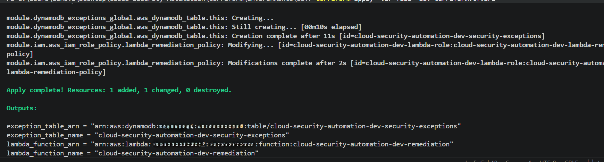

**DynamoDB is active with the `pk`/`sk` composite key, on-demand capacity, point-in-time recovery, TTL, and encryption enabled.**

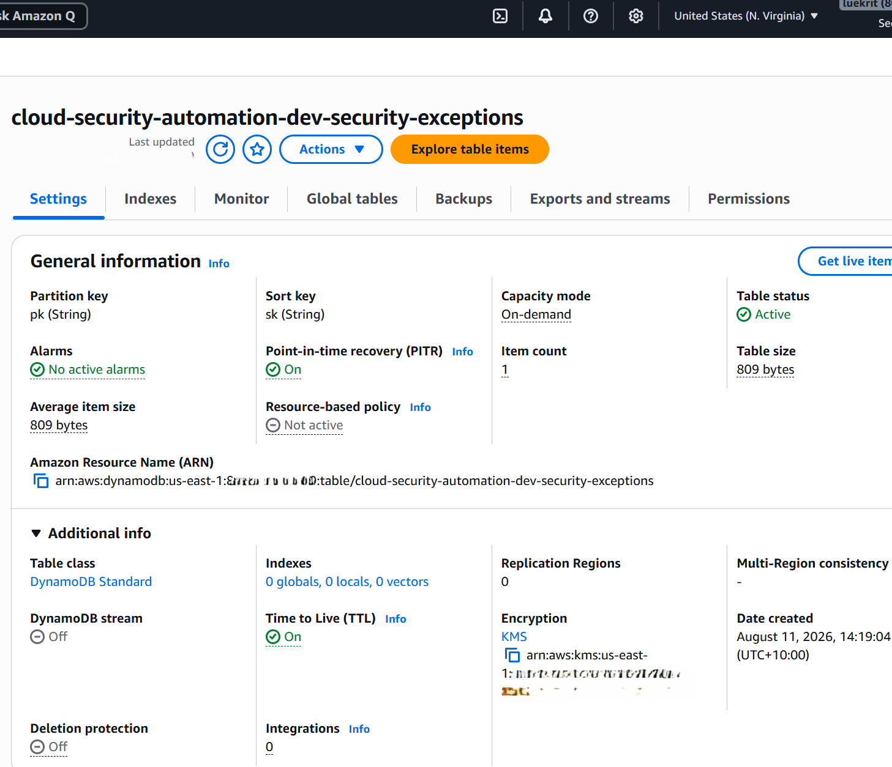

Additional configuration evidence

**The Lambda is explicitly configured for dry-run operation and the `us-east-1` exception table.**

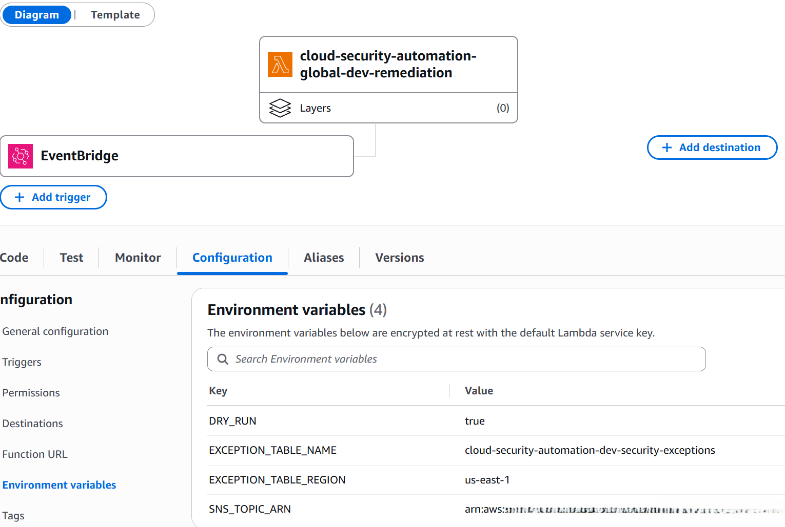

**The Lambda execution role has read-only `dynamodb:GetItem` access to the exception table.**

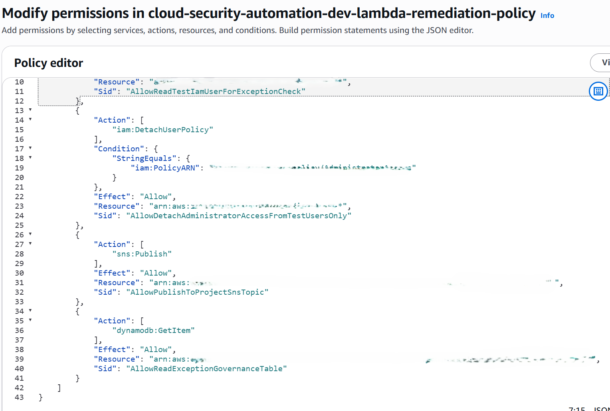

**DynamoDB TTL uses the separate retention field `ttl_delete_at_epoch`.**

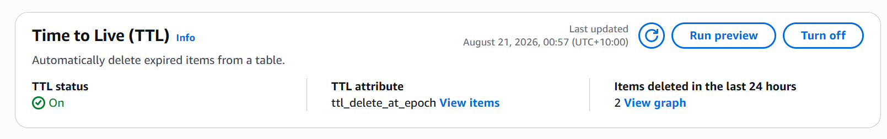

#### Governance decision evidence

**No exception record: fail closed to `REMEDIATE`; dry-run prevents the IAM mutation.**

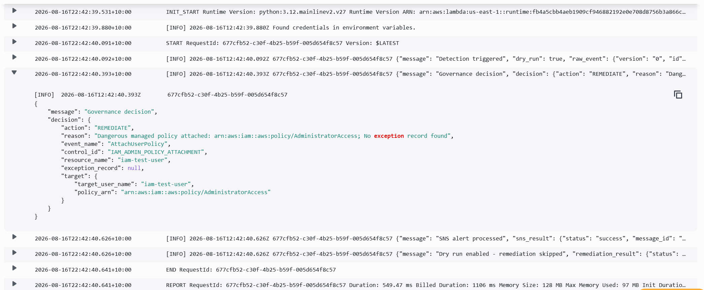

**Approved and unexpired exception: `SKIP_APPROVED` with approval and ticket context retained in the decision log.**

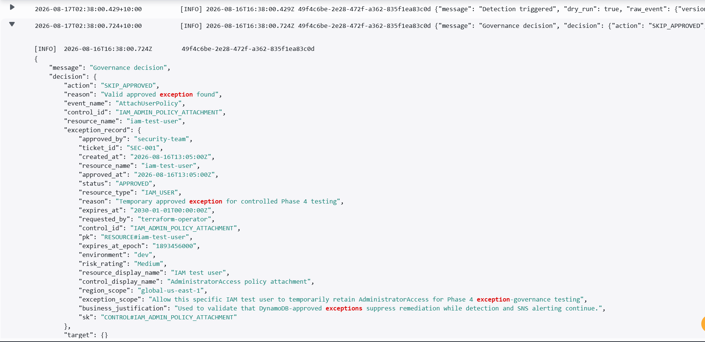

Additional decision-path evidence

**Approved exception: the action stage confirms that no remediation was performed.**

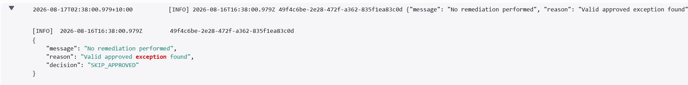

**Pending exception: a request is not an approval, so the decision remains `REMEDIATE`.**

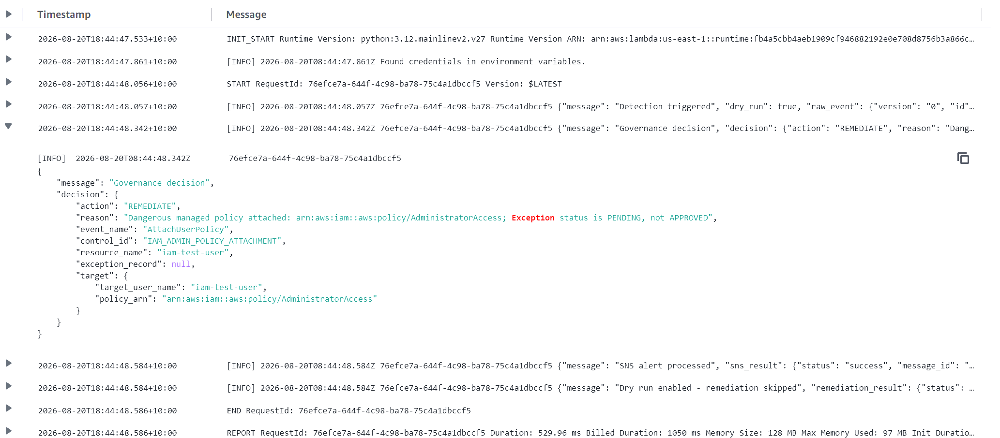

**Expired exception: read-time expiry enforcement returns `REMEDIATE`.**

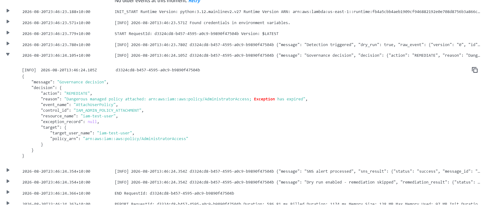

**Approval for another resource: the exact-key lookup finds no applicable record and returns `REMEDIATE`.**

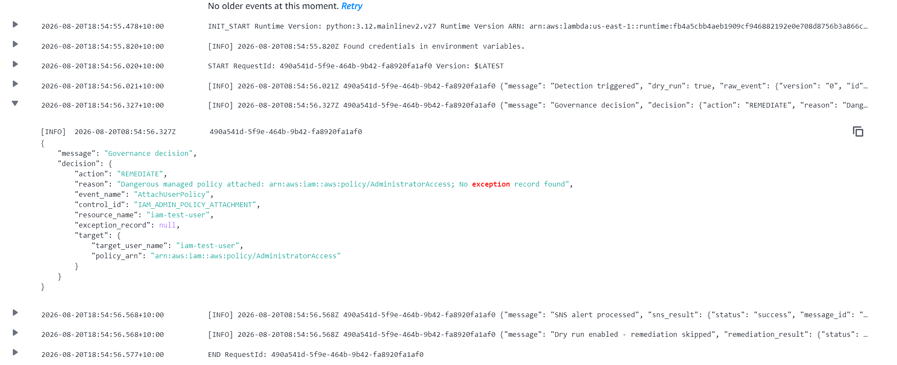

### TTL design correction

The initial expired-exception test returned “no record found” because one timestamp controlled both approval validity and DynamoDB deletion. The record could be deleted before Lambda evaluated why it was invalid.

The corrected design separates:

- `expires_at_epoch`: the security decision boundary, checked synchronously by Lambda.
- `ttl_delete_at_epoch`: delayed physical deletion after the required retention period.

This matters because DynamoDB TTL deletion is asynchronous and expired records can remain readable until the service deletes them. Security validity therefore cannot depend on physical deletion.

## Engineering decisions

### Why the response path is in `us-east-1`

IAM is a global service. Testing showed that the original regional EventBridge path did not reliably receive the required IAM event. A separate global response path was therefore deployed in `us-east-1` instead of moving the entire project out of `ap-southeast-2`.

### Why DynamoDB replaced IAM tags

The tag-based exception lived on the same identity being protected and could be self-issued by a principal with `iam:TagUser`. The DynamoDB design separates approval data from the IAM resource, narrows it by resource and control, records approval context, and prevents the remediation Lambda from writing approvals.

### Why expiry is checked in code

DynamoDB TTL is a retention feature, not an authorization decision. Deletion is asynchronous, so Lambda checks `expires_at_epoch` at read time and uses the TTL field only for later cleanup.

### Why CloudTrail uses a customer-managed KMS key

An AWS-managed key provides encryption at rest. A customer-managed key also provides control over the key policy and an auditable boundary for access to security evidence.

### Why dry-run remains enabled

Removing IAM access can disrupt legitimate operations. The project validates detection, alerting, scope checks, exception handling, and decision logic before granting the automation permission to enforce the decision against controlled targets.

## Terraform design

- Reusable modules for IAM, Lambda, EventBridge, SNS, CloudTrail, S3, and DynamoDB.
- Separate `dev` and intentionally empty `prod` environment directories.
- Provider alias for the `us-east-1` global path.
- Remote S3 state with separate bootstrap and environment keys.
- Native S3 state locking through `use_lockfile=true`.
- Deployment through an assumed Terraform execution role rather than long-term administrator credentials.

## Roadmap and status

| Phase | Outcome | Status |
|---|---|---:|
| 1 | Secure deployment identity and initial Terraform skeleton | Complete |
| 2 | Backend separation and event-aware detection logic | Complete |
| 3 | End-to-end global IAM detection, SNS alerting, and initial tag exception | Complete |
| 3.5 | Remote-state and Lambda least-privilege hardening | Complete |
| 4 | Audit hardening and DynamoDB exception governance | **Complete** |
| 4.5 | Checkov IaC gate and Prowler deployed-posture assessment | Next |
| 5 | AWS Security Hub integration using ASFF findings | Planned |
| 6 | Controlled live remediation | Planned |
| 7 | CI/CD security and deployment gates | Planned |
| 8 | AI-assisted triage with deterministic enforcement boundaries | Planned |

## Repository structure

| Path | Purpose |
|---|---|
| `lambda/src/remediate.py` | Registry handlers, exception evaluation, alerting, and remediation engine |
| `terraform/bootstrap/backend/` | Remote-state bootstrap configuration |
| `terraform/environments/dev/` | Deployed development environment and regional provider wiring |
| `terraform/environments/prod/` | Production placeholder and promotion prerequisites |
| `terraform/modules/` | Reusable AWS infrastructure modules |
| `diagrams/` | Architecture and validation evidence |

## Historical validation evidence

The following Phase 3 evidence demonstrates the original end-to-end detection and alerting pipeline. The IAM-tag exception visible in this historical test was superseded by DynamoDB governance in Phase 4.

**Unapproved attachment: CloudWatch detection and dry-run decision**

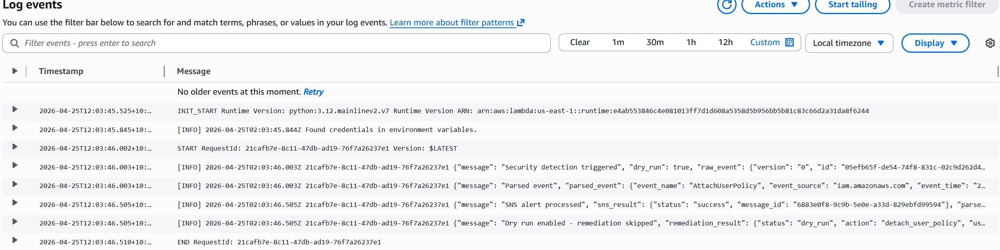

**Unapproved attachment: SNS alert showing remediation approved**

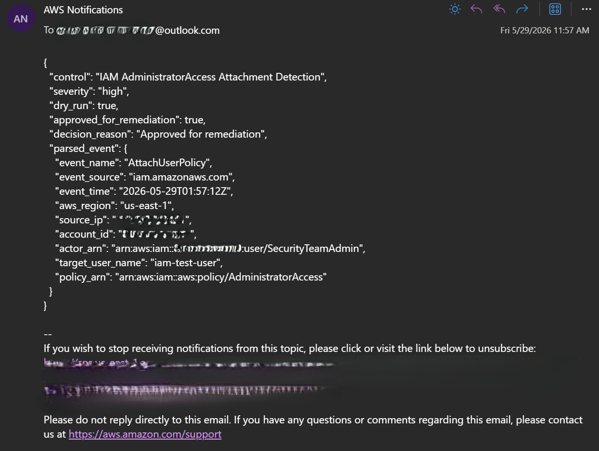

**Approved tag exception: CloudWatch decision evidence from Phase 3**

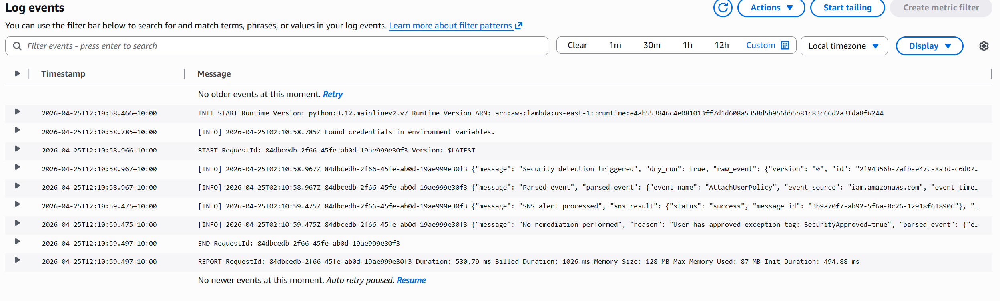

**Approved tag exception: SNS alert showing skip decision**

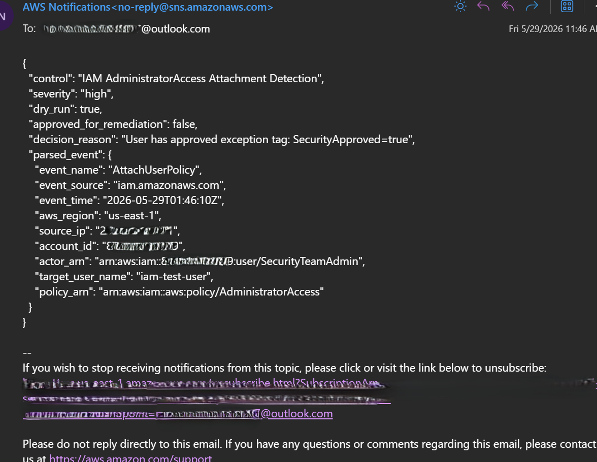
## Current limitations

- Only `AttachUserPolicy` with `AdministratorAccess` is routed and validated end to end.
- Live remediation is intentionally disabled.
- The approval-authoring and maker/checker workflow is currently manual and out-of-band.
- The additional registry controls still require EventBridge routing, test fixtures, permission review, and end-to-end validation.
- Phase 4.5 Checkov and Prowler validation has not yet been completed.
- Security Hub integration, CI/CD enforcement, production monitoring, service-level objectives, and recovery testing remain future work.

These limitations are explicit so the project demonstrates engineering judgement without overstating production maturity.

## Technologies

Terraform, Python, Boto3, AWS IAM, CloudTrail, EventBridge, Lambda, DynamoDB, SNS, CloudWatch Logs, S3, KMS, and GitHub.

## Next milestone

**Phase 4.5: Security validation gates**

- Run Checkov against the Terraform source.
- Fix genuine misconfigurations and document narrowly justified suppressions.
- Run Prowler against the deployed AWS environment using a separate read-only audit identity.
- Re-scan and retain sanitized evidence without publishing raw account-level reports.

