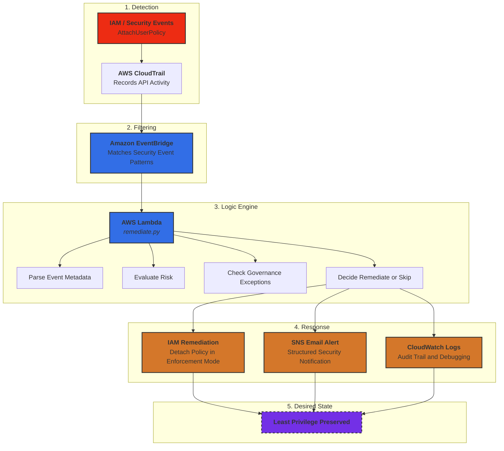
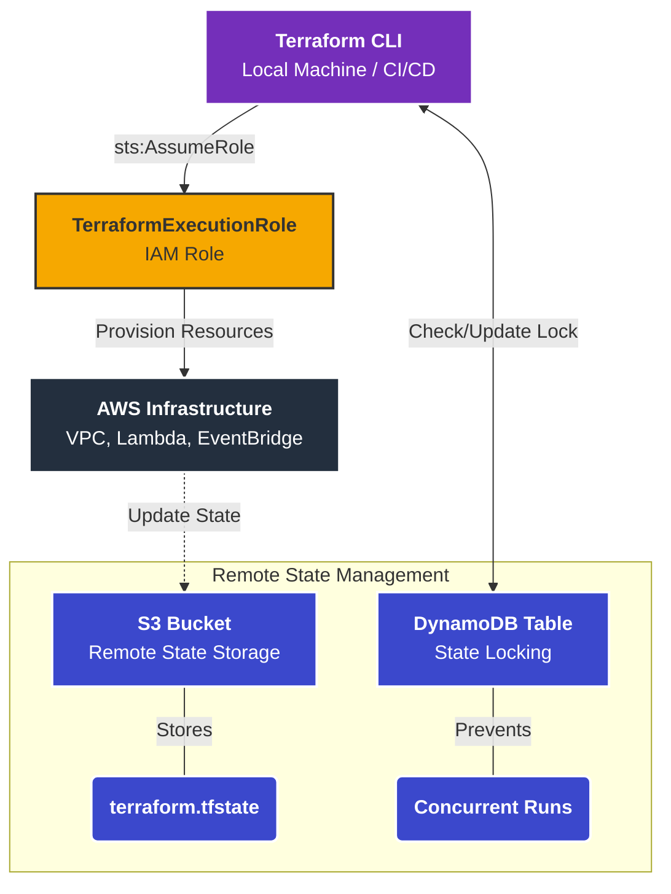

# Cloud Security Automation & Remediation

**AWS | Terraform | IAM | EventBridge | Lambda | CloudTrail | SNS | Python**

A cloud security engineering project demonstrating **event-driven detection, alerting, and governance-aware remediation decision logic** using Terraform and AWS native services.

This project simulates how modern cloud environments detect risky IAM privilege escalation activity, notify security teams, evaluate approved exceptions, and support safe remediation through a **dry-run-first** approach.

---

# Project Overview

This project implements a **self-healing cloud security architecture** that detects high-risk IAM policy attachment activity in near real time.

Instead of relying on manual incident response, the system:

- Monitors AWS API activity using CloudTrail
- Detects security-relevant events using EventBridge
- Triggers response logic using Lambda
- Sends security alerts using SNS email
- Evaluates governance-aware exceptions using IAM tags
- Supports automated remediation in a controlled manner

The current implementation focuses on **AdministratorAccess attachment detection** for IAM users and validates the control through **dry-run testing** before enabling real enforcement.

---

# Architecture Diagram

---

---

# Key Security Capabilities

## Event-Driven Threat Detection

The system currently monitors IAM-related API activity, with the main validated use case focused on:

- AttachRolePolicy  

EventBridge filters matching CloudTrail events in real time and invokes the Lambda response workflow.

---

## Governance-Aware Response Logic

The Lambda response engine:

- Parses incoming CloudTrail event metadata
- Identifies targeted IAM users and risky policy attachments
- Evaluates whether remediation is in scope
- Checks approved exception tags such as:
  - `SecurityApproved=true`
- Decides whether to remediate or skip

This creates a more realistic security control by combining technical detection with **governance-aware exception handling**.

---

## SNS Alerting

When a risky IAM event is detected, the system sends a structured SNS email alert containing:

- Event name
- Actor ARN
- Target user
- Policy ARN
- Dry-run status
- Remediation decision
- Reason for approval or skip

This improves operational visibility before full enforcement is enabled.

---

## Dry-Run Safety Mode

The control currently operates in **dry-run mode**.

This means:

- Risky activity is still detected
- Alerts are still sent
- Decisions are still logged
- but no actual IAM detachment is performed yet

This allows safe validation before enabling live remediation.

---

## Security Logging & Visibility

All remediation actions are logged to:

- **Amazon CloudWatch Logs**

This provides:

- Audit trail for security actions  
- Debugging capability  
- Operational visibility
- Evidence for validation and testing

---

# Attack Simulation

To validate the system, the following scenario is tested:

1. A user or role is granted the **AdministratorAccess** policy  
2. CloudTrail records the IAM policy change  
3. EventBridge detects the matching event  
4. Lambda evaluates the event
5. SNS sends a structured security alert  
6. Lambda either:  
    - approves remediation in dry-run mode, or
    - skips remediation if an approved exception tag is present

---
# Terraform Infrastructure

Infrastructure is deployed using **Terraform with secure best practices**.

---
## Infrastructure Design

---

## Key Infrastructure Features

- Modular Terraform architecture  
- Secure access using **AssumeRole (no long-term credentials)**  
- Remote state storage in **S3**  
- State locking using **DynamoDB**  
- Reusable modules for IAM, Lambda, EventBridge, SNS, CloudTrail, and S3
- Separate global path in us-east-1 for IAM event handling

---

# Validation Results

This phase validated the end-to-end detection, alerting, and governance-aware exception handling of the project in **dry-run mode**.

## Test Scenario A — Unapproved AdministratorAccess attachment

**Objective:** Confirm that the control detects a high-risk IAM policy attachment, sends an alert, and approves remediation when no exception applies.

**Test action**
- Attached `AdministratorAccess` to `iam-test-user`

**Expected behavior**
- CloudTrail records the IAM API event
- EventBridge matches the event
- Lambda is invoked in `us-east-1`
- SNS email alert is sent
- Remediation is approved
- Because `DRY_RUN=true`, no actual detach occurs

**Observed result**
- Lambda logs showed:
  - `Security detection triggered`
  - `Parsed event`
  - `SNS alert processed`
  - `Dry run enabled - remediation skipped`
- SNS email alert showed:
  - `approved_for_remediation: true`
  - `decision_reason: "Approved for remediation"`

**Evidence**

**Figure 1. Test A — CloudWatch log showing detection, SNS alerting, and dry-run remediation approval**  

**Figure 2. Test A — SNS email alert showing remediation approved**  

**Outcome**
- Detection worked
- Alerting worked
- Remediation decision logic worked
- Dry-run safety control worked

---

## Test Scenario B — Approved exception using IAM tag

**Objective:** Confirm that the control still detects and alerts on the risky IAM event, but skips remediation when the target user has an approved exception tag.

**Test action**
- Added IAM user tag:
  - `SecurityApproved = true`
- Attached `AdministratorAccess` to `iam-test-user`

**Expected behavior**
- CloudTrail records the IAM API event
- EventBridge matches the event
- Lambda is invoked in `us-east-1`
- SNS email alert is sent
- Remediation is **not** approved because the target user has an approved exception tag
- Lambda logs the skip reason clearly

**Observed result**
- Lambda logs showed:
  - `Security detection triggered`
  - `Parsed event`
  - `SNS alert processed`
  - `No remediation performed`
- SNS email alert showed:
  - `approved_for_remediation: false`
  - `decision_reason: "User has approved exception tag: SecurityApproved=true"`

**Evidence**

**Figure 3. Test B — CloudWatch log showing alerting and exception-based remediation skip**  
](https://github.com/Luekrit/Cloud-Security-Automation/blob/main/diagrams/Screenshot%20Log%20Event%20for%20Test%20B.png)

**Figure 4. Test B — SNS email alert showing approved exception decision**  
](https://github.com/Luekrit/Cloud-Security-Automation/blob/main/diagrams/Screenshot%20SNS%20notification%20for%20test%20B.png)

**Outcome**
- Detection worked
- Alerting worked
- Governance-aware exception handling worked
- Approved exceptions were skipped correctly

---

## Validation Summary

These tests confirmed that the control can:

- detect risky IAM policy attachment events
- alert security teams through SNS email
- support safe rollout using dry-run mode
- apply governance-aware exception handling using IAM user tags

This phase demonstrates a more realistic security engineering workflow:

**CloudTrail → EventBridge → Lambda → SNS alert → Dry-run remediation decision**

# Security Principles Demonstrated

This project applies core cloud security engineering practices:

- **Least Privilege Access Control**  
- **Event-Driven Security Automation**  
- **Infrastructure as Code (IaC) Security**  
- **Automated Incident Response**  
- **Cloud Identity Protection**  

---

# Technologies Used

- Terraform  
- AWS IAM  
- AWS CloudTrail  
- Amazon EventBridge  
- AWS Lambda  
- Amazon CloudWatch Logs
- Amazon SNS  
- Python  

---

# Why This Project Exists

This project was inspired by a security lesson learned during earlier development, where improper credential handling highlighted how easily cloud misconfigurations can introduce risk.

The goal of this project is to demonstrate how **automation and security engineering practices can prevent those risks from persisting in real environments**.

---

# Future Improvements

- Add detection for additional IAM abuse scenarios  
- Integrate alerting via **SNS / Slack notifications**  
- Expand remediation logic for broader security events  
- Integrate with **AWS Security Hub or SIEM tools**  
- Add anomaly detection for unusual API behavior  

---
