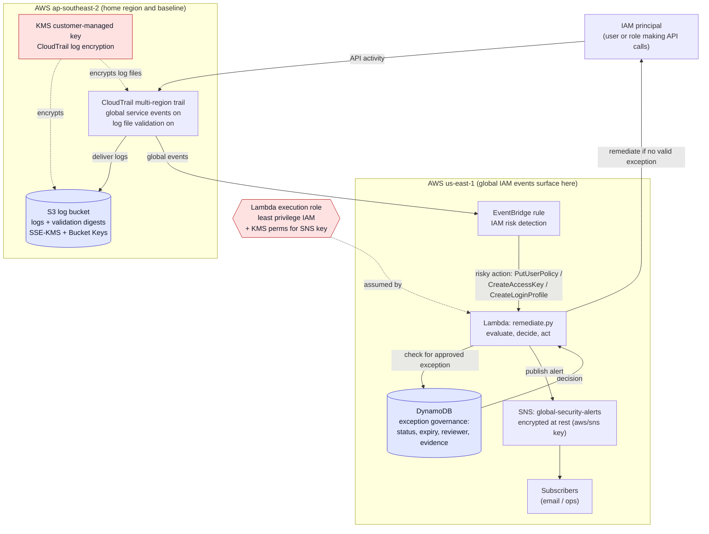
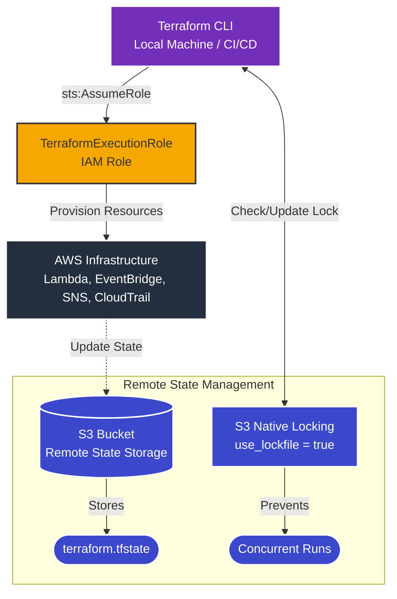

# Cloud Security Automation & Remediation

**AWS | Terraform | IAM | EventBridge | Lambda | CloudTrail | SNS | Python**

A cloud security engineering project demonstrating **event-driven detection, alerting, and governance-aware remediation decision logic** using Terraform and AWS native services.

This project simulates how modern cloud environments detect risky IAM privilege escalation activity, notify security teams, evaluate approved exceptions, and support safe remediation through a **dry-run-first** approach.

---

# Project Overview

This project implements a **cloud security automation architecture** that detects high-risk IAM policy attachment activity in near real time.

Instead of relying on manual incident response, the system:

- Monitors AWS API activity using CloudTrail
- Detects security-relevant events using EventBridge
- Triggers response logic using Lambda
- Sends security alerts using SNS email
- Evaluates governance-aware exceptions using IAM tags
- Supports automated remediation in a controlled manner

The current implementation focuses on **AdministratorAccess attachment detection** for IAM users and validates the control through **dry-run testing** before enabling real enforcement.

---

# Business Impact & Security Value

This project addresses real risks that appear in production cloud environments
and regulated industries, including critical infrastructure and financial services.

## Why IAM privilege escalation matters

Unrestricted IAM access is one of the most common entry points for cloud
breaches. Attaching AdministratorAccess to a user grants full control over
an AWS account — including the ability to create backdoor credentials, exfiltrate
data, or destroy infrastructure. In regulated environments such as those governed
by APRA CPS 234 or the ASD Essential Eight, detecting and responding to
privilege escalation is a baseline control requirement, not an optional feature.

Manual incident response introduces detection lag. This project demonstrates
how event-driven automation reduces that lag to near real time.

## Control value by phase

**Detection and alerting (Phase 3)**
The pipeline detects a risky IAM policy attachment and notifies the security
team within seconds of the API call. Without this, the same activity would
only surface in a periodic access review or a manual CloudTrail query —
potentially hours or days later.

**Governance-aware exception handling (Phase 3)**
Blanket auto-remediation creates operational risk — it can remove legitimate
access and cause outages. The tag-based exception mechanism, and its replacement
DynamoDB governance layer, mean the control can operate in environments where
some privileged access is intentional and approved, without generating false
positive remediations.

**Blast radius control (Phase 3.5)**
Restricting the Lambda execution role to iam-test-* users and a single policy
ARN means a misconfiguration or bug in the remediation logic cannot affect
production identities. This is the principle of least privilege applied to
the automation itself, not just the resources it manages.

**Audit integrity (Phase 4)**
Detection is only valuable if the evidence behind it can be trusted. CloudTrail
log file validation with digest files means tampered or deleted log files can
be detected. A customer-managed KMS key for log encryption means key access
can be governed and audited — satisfying the evidence integrity requirements
that appear in APRA CPS 234 and ISO 27001 audit contexts.

---

# Architecture Diagram

---

# Key Security Capabilities

## Event-Driven Threat Detection

The system currently monitors IAM-related API activity, with the main validated use case focused on:

- AttachUserPolicy  

EventBridge filters matching CloudTrail events in real time and invokes the Lambda response workflow.

---

## Governance-Aware Response Logic

The Lambda response engine:

- Parses incoming CloudTrail event metadata
- Identifies targeted IAM users and risky policy attachments
- Evaluates whether remediation is in scope
- Checks approved exception tags such as:
  - `SecurityApproved=true`
- Decides whether to remediate or skip

This creates a more realistic security control by combining technical detection with **governance-aware exception handling**.

---

## SNS Alerting

When a risky IAM event is detected, the system sends a structured SNS email alert containing:

- Event name
- Actor ARN
- Target user
- Policy ARN
- Dry-run status
- Remediation decision
- Reason for approval or skip

This improves operational visibility before full enforcement is enabled.

---

## Dry-Run Safety Mode

The control currently operates in **dry-run mode**.

This means:

- Risky activity is still detected
- Alerts are still sent
- Decisions are still logged
- but no actual IAM detachment is performed yet

This allows safe validation before enabling live remediation.

---

## Security Logging & Visibility

All remediation actions are logged to:

- **Amazon CloudWatch Logs**

This provides:

- Audit trail for security actions  
- Debugging capability  
- Operational visibility
- Evidence for validation and testing

---

# Attack Simulation

To validate the system, the following scenario is tested:

1. An IAM user is granted the **AdministratorAccess** policy  
2. CloudTrail records the IAM policy change  
3. EventBridge detects the matching event  
4. Lambda evaluates the event
5. SNS sends a structured security alert  
6. Lambda either:  
    - approves remediation in dry-run mode, or
    - skips remediation if an approved exception tag is present

---
# Terraform Infrastructure

Infrastructure is deployed using **Terraform with secure best practices**.

---

## Infrastructure Design

---

## Key Infrastructure Features

- Modular Terraform architecture  
- Secure access using **AssumeRole (no long-term credentials)**  
- Remote state storage in **S3**  
- S3 Native Locking (use_lockfile = true)  
- Reusable modules for IAM, Lambda, EventBridge, SNS, CloudTrail, and S3
- Separate global path in us-east-1 for IAM event handling
- Hardened Lambda execution role with scoped IAM permissions
- Controlled remediation scope limited to test IAM users matching `iam-test-*`

---

# Project Phases

This project was built incrementally, with each phase validated before moving to the next.

---

## Phase 1: Initial Deployment & Secure Credential Model

Before writing any application logic, I established a secure foundation for managing infrastructure.

- Set up a least-privilege Terraform execution model using an IAM operator profile with AssumeRole, avoiding long-term admin credentials for deployment
- Built initial Terraform modules for IAM, Lambda, and EventBridge
- Deployed the core pipeline skeleton — Lambda function, Lambda execution role, EventBridge rule and target, and the Lambda invoke permission — and confirmed successful deployment via Terraform state and outputs
- Adopted a deploy/destroy workflow (`terraform apply` → test → `terraform destroy`) to control AWS cost during development

This phase produced a working infrastructure skeleton, not yet a validated detection or remediation control.

---

## Phase 2: Backend Separation & Detection Logic Refinement

With the skeleton in place, I focused on separating infrastructure concerns and correcting the detection logic.

- Split Terraform state management into a dedicated bootstrap module (S3 state bucket + DynamoDB lock table), separate from the `dev` environment state
- Reviewed the initial Lambda logging logic and corrected a mismatch: the log message described IAM user creation, but the EventBridge rule was actually monitoring IAM policy-attachment events (`AttachUserPolicy`, `AttachRolePolicy`, `PutUserPolicy`, etc.)
- Rebuilt the Lambda function as an event-aware, logging-only version that correctly parses `eventName`, `userName`, `roleName`, and `policyArn` from the CloudTrail event detail — remediation logic was intentionally deferred to a later phase

---

## Phase 3: Full Module Implementation & Global IAM Architecture

This phase completed the remaining infrastructure modules and resolved a significant architectural issue.

- Implemented the remaining CloudTrail, EventBridge, and S3 Terraform modules
- During testing, IAM events were not appearing in CloudTrail or triggering EventBridge in the primary region. Root cause: **IAM is a global AWS service**, and its management events are only reliably captured by CloudTrail and matched by EventBridge in `us-east-1`
- Redesigned the architecture to add a dedicated global detection path — a second Lambda, EventBridge rule, and SNS topic (`lambda_global`, `eventbridge_global`, `sns_global`) deployed via the `aws.global` provider alias — to correctly capture and process real IAM events
- Implemented SNS email alerting and tag-based exception handling (`SecurityApproved=true` on the target IAM user)
- Validated the full pipeline with two test scenarios:
  - **Test A** (no exception tag): risky `AttachUserPolicy` event detected, SNS alert sent, remediation approved in dry-run mode
  - **Test B** (approved exception tag): event still detected and alerted, but remediation correctly skipped due to the exception tag

This phase produced the first fully working, validated dry-run detection-to-decision pipeline.

---

## Validation Results

This phase validated the end-to-end detection, alerting, and governance-aware exception handling of the project in **dry-run mode**.

## Test Scenario A — Unapproved AdministratorAccess attachment

**Objective:** Confirm that the control detects a high-risk IAM policy attachment, sends an alert, and approves remediation when no exception applies.

**Test action**
- Attached `AdministratorAccess` to `iam-test-user`

**Expected behavior**
- CloudTrail records the IAM API event
- EventBridge matches the event
- Lambda is invoked in `us-east-1`
- SNS email alert is sent
- Remediation is approved
- Because `DRY_RUN=true`, no actual detach occurs

**Observed result**
- Lambda logs showed:
  - `Security detection triggered`
  - `Parsed event`
  - `SNS alert processed`
  - `Dry run enabled - remediation skipped`
- SNS email alert showed:
  - `approved_for_remediation: true`
  - `decision_reason: "Approved for remediation"`

**Evidence**

**Figure 1. Test A — CloudWatch log showing detection, SNS alerting, and dry-run remediation approval**  

**Figure 2. Test A — SNS email alert showing remediation approved**  

**Outcome**
- Detection worked
- Alerting worked
- Remediation decision logic worked
- Dry-run safety control worked

---

## Test Scenario B — Approved exception using IAM tag

**Objective:** Confirm that the control still detects and alerts on the risky IAM event, but skips remediation when the target user has an approved exception tag.

**Test action**
- Added IAM user tag:
  - `SecurityApproved = true`
- Attached `AdministratorAccess` to `iam-test-user`

**Expected behavior**
- CloudTrail records the IAM API event
- EventBridge matches the event
- Lambda is invoked in `us-east-1`
- SNS email alert is sent
- Remediation is **not** approved because the target user has an approved exception tag
- Lambda logs the skip reason clearly

**Observed result**
- Lambda logs showed:
  - `Security detection triggered`
  - `Parsed event`
  - `SNS alert processed`
  - `No remediation performed`
- SNS email alert showed:
  - `approved_for_remediation: false`
  - `decision_reason: "User has approved exception tag: SecurityApproved=true"`

**Evidence**

**Figure 3. Test B — CloudWatch log showing alerting and exception-based remediation skip**  

**Figure 4. Test B — SNS email alert showing approved exception decision**  

**Outcome**
- Detection worked
- Alerting worked
- Governance-aware exception handling worked
- Approved exceptions were skipped correctly

---

## Phase 3.5: Infrastructure & Lambda Role Hardening

Before enabling live remediation, I completed a hardening pass to improve the project’s Terraform state management and Lambda execution role permissions.

This phase focused on reducing operational risk before moving from dry-run testing toward controlled enforcement.

### Remote State & Locking Hardening

Terraform state was moved to a remote backend using:

* **Amazon S3** for remote state storage
* **S3 native locking via use_lockfile** = true (migrated from DynamoDB in phase 4)
* Separate backend paths for bootstrap and environment state
* Environment-specific state separation for safer infrastructure management

This improves reliability by preventing local state drift and reducing the risk of concurrent Terraform runs modifying the same infrastructure.

### Lambda Execution Role Hardening

The Lambda remediation policy was also tightened to reduce the blast radius of automated remediation.

The original policy allowed IAM read and detach actions across all resources. This was acceptable for early testing, but too broad for a realistic security automation workflow.

The updated Lambda execution role now limits permissions so the function can:

* Read IAM user details and tags only for controlled test users matching `iam-test-*`
* Detach only the AWS-managed `AdministratorAccess` policy
* Apply remediation only to test IAM users matching the `iam-test-*` naming pattern
* Publish alerts only to the project SNS topic

This improves least-privilege posture while keeping the workflow functional for controlled validation.

## Phase 3.5 Validation

After applying the Terraform changes, the workflow was retested in dry-run mode.

Validation confirmed:

* Terraform applied the IAM policy update successfully with `0 added, 1 changed, 0 destroyed`
* SNS alerting continued to work
* CloudWatch logs confirmed Lambda execution
* Test A: user without an exception tag was approved for remediation in dry-run mode
* Test B: user with `SecurityApproved=true` was detected but skipped for remediation
* `DRY_RUN=true` remained enabled, so no live policy detachment occurred

This confirms the automation can still detect risky IAM activity, send alerts, evaluate exception tags, and make remediation decisions after the Lambda role was restricted.

---

## Phase 4: Infrastructure Hardening & DynamoDB Exception Governance

This phase runs two parallel workstreams. The hardening controls are complete.
The DynamoDB exception governance workstream is currently in progress.

---

## Phase 4 Workstream 1: Infrastructure Hardening Controls ✅

Before expanding remediation scope, I completed a hardening pass focused on
audit integrity, encryption governance, and infrastructure maintainability.

### CloudTrail Log File Validation
- Enabled CloudTrail digest files, making the audit trail tamper-evident
- Digest files reveal whether log files were modified or deleted after delivery
- This addresses a gap where detection could work but evidence integrity
  could not be proven

### S3 Log Bucket Encryption (SSE-KMS with Bucket Keys)
- Migrated CloudTrail log bucket from AES-256 to SSE-KMS encryption
- Enabled Bucket Keys to reduce KMS API request cost at scale

### Customer-Managed KMS Key for CloudTrail
- Created a dedicated customer-managed KMS key with a readable alias
- Wrote a scoped key policy granting CloudTrail only what it needs,
  conditioned on the trail ARN rather than a broad wildcard
- Confirmed CloudTrail continued logging with no delivery errors after
  the key switch — a bad key policy fails silently, so this verification
  was intentional
- Verified drift-free in Terraform

The principle: an AWS-managed key gets you encryption. A customer-managed
key gets you governance. For an audit trail, owning the key policy is what
lets you control who can read the evidence.

### SNS Topic Encryption
- Encrypted the SNS alert topic at rest
- Verified the end-to-end alerting path still published correctly after
  encryption — rather than assuming encryption left it intact

### S3 Native State Locking Migration
- Replaced the deprecated `dynamodb_table` backend argument with
  `use_lockfile = true` (GA in Terraform 1.11)
- Updated minimum Terraform version to `>= 1.11.0`
- Re-initialized both bootstrap and dev backends
- Validated locking behavior with a concurrent two-terminal contention
  test before removing the old DynamoDB table — the second operation
  correctly failed with a state lock error, proving the new mechanism
  worked
- Removed the old `terraform-state-lock` DynamoDB table and cleaned up
  unused variables and outputs
- Merged via clean PR

### Production Environment Separation
- Established an intentionally empty production environment with documented
  conditions for what must be true before anything is promoted beyond dev

---

## Phase 4 Workstream 2: DynamoDB Exception Governance 🔄 In Progress

The current tag-based exception mechanism (`SecurityApproved=true` on IAM
users) has a critical security flaw: it is self-approving and bypassable
by anyone with `iam:TagUser` permission.

This workstream replaces it with a DynamoDB-backed governance table
providing:

- Maker/checker separation (requester and approver must be different)
- TTL-based expiry with mandatory read-time expiry checks (DynamoDB TTL
  deletion can lag up to 48 hours — relying on deletion alone is not safe)
- Immutable audit trail of exception decisions
- Exception records stored in `us-east-1` to be visible to `lambda_global`

---

# Key Engineering Decisions & Challenges

## Why us-east-1 for IAM event detection

IAM is a global AWS service. During testing, IAM API events were not appearing
in the ap-southeast-2 CloudTrail or triggering the EventBridge rule in the
primary region. Root cause: AWS only surfaces IAM management events reliably
in us-east-1, regardless of where the API call originates.

The fix was to add a dedicated global detection path — a separate Lambda,
EventBridge rule, and SNS topic deployed via the aws.global provider alias
in Terraform — rather than moving the entire project to us-east-1 or accepting
unreliable detection. This is a non-obvious AWS behavior that affects any
project that automates IAM governance across regions.

## Why DynamoDB governance replaces tag-based exceptions

The original exception mechanism used an IAM user tag (SecurityApproved=true)
to signal approved exceptions. This has a critical flaw: anyone with
iam:TagUser permission can add the tag themselves, bypassing the control
entirely. It is self-approving by design.

The replacement uses a DynamoDB governance table with maker/checker separation
— the requester and approver must be different identities. It also enforces
TTL-based expiry, but with a specific constraint: DynamoDB TTL deletion can
lag up to 48 hours after the expiry timestamp. Relying on TTL deletion alone
for access control decisions is unsafe. The Lambda logic performs a read-time
expiry check against the stored timestamp, independent of whether DynamoDB
has deleted the record yet.

## Why a customer-managed KMS key for CloudTrail

An AWS-managed key provides encryption at rest. A customer-managed key
provides governance — the ability to define who can decrypt log files,
scope access by trail ARN, and produce an auditable key policy. For an
audit trail, the distinction matters: if you cannot govern the key, you
cannot fully control who reads the evidence. The key policy in this project
conditions CloudTrail's encryption permission on the specific trail ARN
rather than a broad wildcard.

## Why S3 native locking replaced DynamoDB state locking

DynamoDB-based Terraform state locking is deprecated as of Terraform 1.11,
which introduced native S3 lockfile support via use_lockfile = true. The
migration was validated before removing the old table: two concurrent
terraform plan operations were run against the same state, confirming the
second operation correctly failed with a lock contention error before the
DynamoDB table was decommissioned. This follows the same safety-first
sequencing used throughout the project — prove the replacement works
before removing the thing it replaces.

## Why dry-run mode before live remediation

Automated remediation that removes IAM access can cause immediate operational
impact if the detection logic has a false positive. Dry-run mode allows the
full pipeline — detection, alerting, exception evaluation, and remediation
decision — to be validated against real events without risk of disrupting
access. The control only moves to enforcement after each layer of the
decision logic has been independently confirmed to work correctly.

# Security Principles Demonstrated

This project applies core cloud security engineering practices:

- **Least Privilege Access Control**  
- **Event-Driven Security Automation**  
- **Infrastructure as Code (IaC) Security**  
- **Automated Incident Response**  
- **Cloud Identity Protection**  

---

# Technologies Used

- Terraform  
- AWS IAM  
- AWS CloudTrail  
- Amazon EventBridge  
- AWS Lambda  
- Amazon CloudWatch Logs
- Amazon SNS  
- Python  

---

# Why This Project Exists

This project was inspired by a security lesson learned during earlier development, where improper credential handling highlighted how easily cloud misconfigurations can introduce risk.

The goal of this project is to demonstrate how **automation and security engineering practices can prevent those risks from persisting in real environments**.

---

# Future Improvements

- Add detection for additional IAM abuse scenarios   
- Expand remediation logic for broader security events  
- Integrate with **AWS Security Hub or SIEM tools**  
- Add anomaly detection for unusual API behavior  

---
