# Cloud Security Automation and Remediation

An AWS portfolio project that detects a high-risk IAM policy attachment, checks a governed exception, alerts an operator, and records a remediation decision before enforcement is enabled.

> **Current status:** Phase 4.5 validation milestone complete · `DRY_RUN=true` · live IAM remediation disabled · Security Hub integration next

## Problem and current outcome

An unexpected `AdministratorAccess` attachment can give an IAM user broad permissions. Periodic access reviews may discover the change late; unrestricted automatic removal can also disrupt legitimate work.

This project evaluates the covered change through an event-driven workflow. Its tested path is **`AttachUserPolicy` for the AWS-managed `AdministratorAccess` policy**, using controlled IAM test users. Lambda checks a resource-and-control-specific DynamoDB exception, attempts an SNS notification, and logs the decision. In dry-run mode it records the intended detach without changing IAM permissions.

The workflow flags a risky change; it does not establish that the account is compromised or reconstruct its full permission baseline.

## Architecture

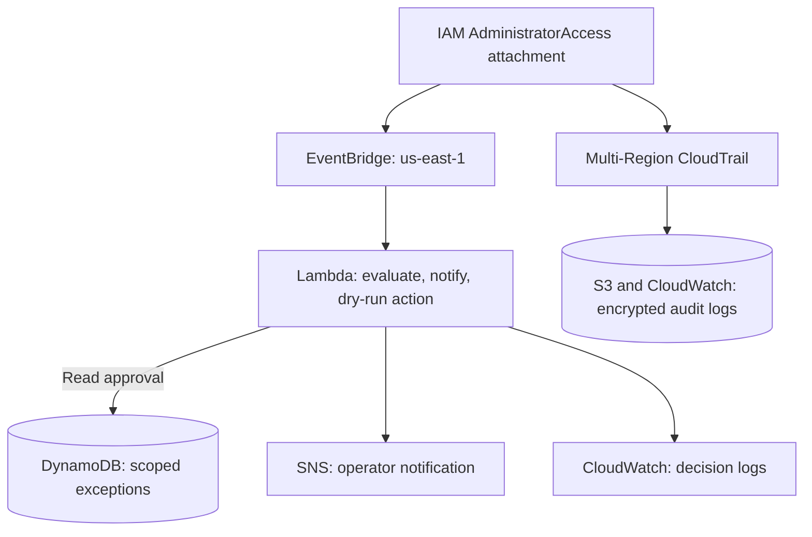
```mermaid
flowchart TB
    EVENT["IAM AdministratorAccess attachment"]
    EB["EventBridge: us-east-1"]
    LAMBDA["Lambda: evaluate, notify, dry-run action"]
    DDB[("DynamoDB: scoped exceptions")]
    SNS["SNS: operator notification"]
    LOGS["CloudWatch: decision logs"]
    CT["Multi-Region CloudTrail"]
    AUDIT[("S3 and CloudWatch: encrypted audit logs")]
    EVENT --> EB
    EB --> LAMBDA
    LAMBDA -->|"Read approval"| DDB
    LAMBDA --> SNS
    LAMBDA --> LOGS
    EVENT --> CT
    CT --> AUDIT
```

The active IAM response path runs in `us-east-1`. The CloudTrail audit stack is managed in `ap-southeast-2`. DynamoDB holds approved exceptions, rather than a complete account-permissions baseline. A Lambda SQS dead-letter queue is configured; failure-path delivery still needs verification (see current limitations).

## Key design decisions

| Decision | Reason |
|---|---|
| Dry-run before enforcement | Validate decisions before removing access |
| IAM detach permission restricted to `iam-test-*` and `AdministratorAccess` | Bound the automation's mutation authority |
| Lambda has only `dynamodb:GetItem` on the exception table | Separate approval records from the responding workload |
| Check approval expiry in code; use a separate TTL timestamp | Enforce validity independently from asynchronous record cleanup |
| Separate notification from the exception decision | Retain visibility when an approved exception suppresses remediation |

Approval authoring is manual and out-of-band. Requester/approver separation is not yet programmatically enforced.

## Validated results

Documented development tests cover no exception, approved/unexpired, pending, expired, and wrong-resource exceptions. The first, third, fourth, and fifth paths produced dry-run remediation decisions; a valid approval produced `SKIP_APPROVED`. Live detachment has not been validated.

| Scanner | Baseline | Final Phase 4.5 scan |
|---|---:|---:|
| Checkov | 65 passed / 26 failed | 96 passed / 18 failed / 0 skipped |
| Prowler targeted assessment | 161 passed / 84 failed | 170 passed / 81 failed / 0 muted |

Remaining findings are classified in the [Phase 4.5 validation register](docs/phase-4.5-security-validation.md). These are counts from different infrastructure snapshots, not a like-for-like pass-rate or production risk-reduction measurement. The register describes configuration checks and runtime validation; it does not establish that every application failure reaches the DLQ.

**Boundary:** this is a single-account portfolio environment with one routed, validated control. Remaining validation and operational limitations are listed below; Phase 4.5 completion does not mean production readiness.

## Implemented scope versus tested coverage

| Control | Lambda registry | EventBridge routed | End-to-end validated | Live remediation |
|---|---:|---:|---:|---:|
| `AttachUserPolicy` with `AdministratorAccess` | Yes | Yes | Yes | No, dry-run only |
| `PutUserPolicy` wildcard administrator policy | Yes | No | No | No |
| `CreateAccessKey` | Yes | No | No | No |
| `CreateLoginProfile` | Yes | No | No | No |

The additional handlers demonstrate an extensible control registry, but they are not presented as live coverage. They will be routed and tested only after the first control completes Security Hub integration and controlled live-remediation validation.

## Key security capabilities

### Event-driven IAM detection

- EventBridge matches `AttachUserPolicy` events for the AWS-managed `AdministratorAccess` policy.
- The active global event path is deployed in `us-east-1` using a Terraform provider alias.
- A multi-Region CloudTrail records management events and includes global service events for audit evidence.

### Registry-based decision engine

`remediate.py` separates event-specific parsing, risk evaluation, and remediation from the generic decision engine. Adding a supported event requires a new registry handler instead of rewriting the main workflow.

The execution order is deliberately:

1. **Decide** whether the event is supported, risky, protected, or excepted. IAM permissions separately enforce the test-user mutation scope.
2. **Notify** by attempting SNS publication regardless of the normal decision outcome.
3. **Act** only when the decision is `REMEDIATE`; dry-run mode currently prevents the mutation.

### DynamoDB exception governance

The original Phase 3 exception used `SecurityApproved=true` on the IAM user. That design was useful for validating the pipeline, but it was not a strong governance boundary: anyone permitted to tag the user could potentially create their own bypass.

Phase 4 replaces the tag with a DynamoDB exception registry:

- Composite key: `RESOURCE#<resource>` and `CONTROL#<control-id>`.
- Exception status must be exactly `APPROVED`.
- `expires_at_epoch` is evaluated by Lambda on every lookup.
- `ttl_delete_at_epoch` is used only for delayed record cleanup.
- Point-in-time recovery protects exception records from accidental deletion or modification.
- Server-side encryption is enabled.
- The Lambda role has only `dynamodb:GetItem` on the project table.

This design supports a maker/checker operating model because the remediation workload can read an approval but cannot create one. The current approval-authoring process remains out-of-band; a future workflow should programmatically verify requester/approver separation and integrate with a ticketing or identity system.

### Exception validation and lookup failures

An exception grants a narrowly scoped approval. Lambda validates the record's resource, control, approval status, and expiry using a strongly consistent DynamoDB read.

Invalid records do not grant approval. A lookup failure postpones remediation: Lambda attempts to notify the operator, then raises an error without changing IAM.

| Exception condition | Decision | Current effect |
|---|---|---|
| Valid, approved, unexpired record for the exact resource/control | `SKIP_APPROVED` | Preserve the approved attachment and report the decision |
| Missing, pending, revoked, or expired record | `REMEDIATE` | Alert and record the intended action in dry-run mode |
| Record for another resource/control | `REMEDIATE` | Alert and record the intended action in dry-run mode |
| Missing or malformed expiry | `REMEDIATE` | Reject the approval, alert, and record the intended action |
| Lookup failure or missing table configuration | `RETRY_REQUIRED` | Attempt notification, then raise without IAM mutation |

Unexpected errors are logged and re-raised. SNS publication failures also raise before IAM mutation.

### Safety guardrails

- `DRY_RUN=true` remains enabled.
- The decision engine rejects targets outside the controlled `iam-test-*` scope.
- Managed-policy detachment is limited to `AdministratorAccess`.
- Protected users return `NO_ACTION`.
- Actor-equals-target events follow the same exception checks as other attachments; self-attachment does not grant an exemption.
- Additional mutation permissions remain disabled behind `enable_extended_remediation=false`.
- The Lambda cannot write exception approvals.

### Alerting and evidence

The current SNS payload includes:

- Control ID and severity
- Decision and reason
- Dry-run state
- Event name and target resource
- Actor ARN, source IP, account ID, and event time
- Exception ticket and approver metadata when an approved exception is used

CloudWatch logs capture the governance decision, SNS result, dry-run action, remediation result, and unexpected errors as structured JSON.

## Current limitations and work before live remediation

- Only `AttachUserPolicy` with `AdministratorAccess` is routed and documented as validated end to end. Other handlers require routing, fixtures, permission review, and validation.
- Live remediation remains disabled. Unit tests cover simulated IAM mutations; actual detachment in AWS remains a future validation step.
- Application failures now raise errors so Lambda can apply its asynchronous retry and DLQ behavior. Runtime DLQ delivery remains unverified: the test invocation was accepted, but the CLI role lacked `sqs:ReceiveMessage` permission to inspect the queue.
- Retries may produce duplicate notifications; persistent event deduplication is not implemented.
- Development Terraform now passes the SNS KMS key ARN to the IAM module and derives the SNS service region from the topic ARN. Publishing succeeded in the existing environment; a fresh deployment has not been validated.
- Approval authoring is manual. Requester/approver separation is not enforced by an approval workflow.
- Remaining scanner findings are documented, not all resolved. Security Hub integration, CI/CD enforcement, recovery testing, and production monitoring remain future work.

These remaining limitations are separate from the completed code fixes and successful dry-run validation.

## Engineering decisions

### Why the response path is in `us-east-1`

IAM is a global service. Testing showed that the original regional EventBridge path did not reliably receive the required IAM event. A separate global response path was therefore deployed in `us-east-1` instead of moving the entire project out of `ap-southeast-2`.

### Why DynamoDB replaced IAM tags

The tag-based exception lived on the same identity being protected and could be self-issued by a principal with `iam:TagUser`. The DynamoDB design separates approval data from the IAM resource, narrows it by resource and control, records approval context, and prevents the remediation Lambda from writing approvals.

### Why expiry is checked in code

DynamoDB TTL is a retention feature, not an authorization decision. Deletion is asynchronous, so Lambda checks `expires_at_epoch` at read time and uses the TTL field only for later cleanup.

### Why CloudTrail uses a customer-managed KMS key

An AWS-managed key provides encryption at rest. A customer-managed key also provides control over the key policy and an auditable boundary for access to security evidence.

### Why dry-run remains enabled

Removing IAM access can disrupt legitimate operations. The project validates detection, alerting, scope checks, exception handling, and decision logic before enabling enforcement against controlled targets. The execution role already has narrowly scoped detach permission; dry-run prevents its use.

## Terraform design

- Reusable modules for IAM, Lambda, EventBridge, SNS, CloudTrail, S3, and DynamoDB.
- Separate `dev` and intentionally empty `prod` environment directories.
- Provider alias for the `us-east-1` global path.
- Remote S3 state with separate bootstrap and environment keys.
- Native S3 state locking through `use_lockfile=true`.
- Deployment through an assumed Terraform execution role rather than long-term administrator credentials.

## Roadmap and status

| Phase | Outcome | Status |
|---|---|---:|
| 1 | Secure deployment identity and initial Terraform skeleton | Complete |
| 2 | Backend separation and event-aware detection logic | Complete |
| 3 | End-to-end global IAM detection, SNS alerting, and initial tag exception | Complete |
| 3.5 | Remote-state and Lambda least-privilege hardening | Complete |
| 4 | Audit hardening and DynamoDB exception governance | **Complete** |
| 4.5 | Checkov IaC gate and Prowler deployed-posture assessment | **Complete** |
| 5 | AWS Security Hub integration using ASFF findings | **Next** |
| 6 | Controlled live remediation | Planned |
| 7 | CI/CD security and deployment gates | Planned |
| 8 | AI-assisted triage with deterministic enforcement boundaries | Planned |

## Repository structure

| Path | Purpose |
|---|---|
| `lambda/src/remediate.py` | Registry handlers, exception evaluation, alerting, and remediation engine |
| `terraform/bootstrap/backend/` | Remote-state bootstrap configuration |
| `terraform/environments/dev/` | Deployed development environment and regional provider wiring |
| `terraform/environments/prod/` | Production placeholder and promotion prerequisites |
| `terraform/modules/` | Reusable AWS infrastructure modules |
| `diagrams/` | Architecture and validation evidence |
| `tests/` | Mocked unit tests and event fixtures for regression and runtime validation |

## Project evolution: Phases 1–4.5

The completed build history covers the deployment foundation, global IAM detection, execution-role hardening, DynamoDB exception governance, and Phase 4.5 security validation. Each phase added a capability or addressed a known risk; the remaining limitations above still apply. Phases 5–8 remain future work in the roadmap.

Build history: Phases 1–3.5

The project was built incrementally. Each phase introduced one architectural capability or reduced one known risk before the next layer was added.

### Phase 1: initial deployment and secure credential model

Phase 1 established the deployment foundation before application-level remediation logic was introduced.

- Configured an IAM operator profile to assume a dedicated Terraform execution role instead of using long-term administrator credentials.
- Built the initial Terraform modules for IAM, Lambda, and EventBridge.
- Deployed the first pipeline skeleton: Lambda function, execution role, EventBridge rule and target, and Lambda invocation permission.
- Confirmed the deployed resources through Terraform state and outputs.
- Used an apply, test, and destroy workflow during early development to control cost and reduce unnecessary resource exposure.

**Outcome:** a reproducible Terraform foundation and secure deployment path, but not yet a validated detection or remediation control.

### Phase 2: backend separation and detection-logic refinement

Phase 2 separated Terraform state management from the application environment and corrected the first version of the event-processing logic.

- Created a dedicated bootstrap configuration for the remote S3 backend, separate from the `dev` environment state.
- Initially used DynamoDB state locking before later migrating to native S3 lockfiles in Phase 4.
- Identified a mismatch between the Lambda log message and the events configured in EventBridge.
- Rebuilt the Lambda as an event-aware, logging-only function that parsed CloudTrail fields including event name, IAM target, and policy ARN.
- Deliberately deferred IAM mutation permissions until the detection path could be validated independently.

**Outcome:** separated backend state and a detection function whose output accurately reflected the API event being processed.

### Phase 3: full module implementation and global IAM architecture

Phase 3 completed the initial end-to-end dry-run pipeline and resolved a regional architecture issue discovered during testing.

- Implemented the CloudTrail, EventBridge, S3, and SNS Terraform modules required for the complete event path.
- Found that the original `ap-southeast-2` EventBridge path did not reliably receive the required global IAM event.
- Added a dedicated `us-east-1` path using the `aws.global` provider alias, with a global Lambda, EventBridge rule, and SNS topic.
- Implemented structured SNS email alerting.
- Added the original IAM-tag exception mechanism to prove that the decision engine could distinguish an approved exception from an unapproved event.
- Kept `DRY_RUN=true` so testing produced decisions and alerts without detaching the policy.

#### Phase 3 validation

Two controlled scenarios validated the first working detection-to-decision pipeline:

| Scenario | Expected result | Observed result |
|---|---|---|
| No `SecurityApproved` tag | Detect, alert, and approve remediation | Passed; IAM change was not executed because dry-run was enabled |
| `SecurityApproved=true` tag | Detect and alert, but skip remediation | Passed |

The tag mechanism was not retained as the final governance design. Its validation proved that detection, alerting, and exception-aware branching worked; Phase 4 then replaced the self-issuable tag with the DynamoDB exception registry.

**Outcome:** the first validated end-to-end IAM detection, SNS alerting, and dry-run decision pipeline.

### Phase 3.5: Terraform state and Lambda role hardening

Phase 3.5 reduced operational and security risk before the governance model was expanded.

#### Remote state hardening

- Stored Terraform state in the remote S3 backend rather than local files.
- Used separate backend keys for bootstrap and the development environment.
- Preserved environment separation to reduce accidental cross-environment changes.
- Retained locking protection against concurrent Terraform operations. Native S3 locking replaced the earlier DynamoDB mechanism during Phase 4.

#### Lambda least-privilege hardening

- Replaced broad IAM resource access with user ARNs restricted to `iam-test-*`.
- Limited managed-policy detachment to the AWS-managed `AdministratorAccess` policy.
- Scoped SNS publishing to the project alert topic.
- Kept the automation's blast radius limited to controlled test identities.

#### Phase 3.5 validation

- Applied the IAM policy change without replacing the Lambda or unrelated resources.
- Re-ran the unapproved and approved-tag scenarios.
- Confirmed SNS alerting and CloudWatch logging continued to work after permissions were tightened.
- Confirmed `DRY_RUN=true` still prevented policy detachment.

**Outcome:** the pipeline remained functional after deployment-state and execution-role hardening, demonstrating that least privilege did not break the validated control.

Phase 4: hardening, governance and validation evidence

### Phase 4: audit hardening and exception governance

Phase 4 combined infrastructure hardening with a replacement for the original tag-based exception model.

### Workstream 1: infrastructure hardening

- Enabled CloudTrail log-file validation so digest files can be used to detect modification or deletion of delivered logs.
- Migrated the CloudTrail log bucket to SSE-KMS using a customer-managed KMS key.
- Enabled S3 Bucket Keys to reduce KMS request overhead.
- Scoped the CloudTrail KMS policy using the trail ARN and encryption context.
- Encrypted the SNS alert topic at rest and revalidated alert delivery.
- Migrated Terraform state locking from the deprecated DynamoDB backend argument to native S3 lockfiles with `use_lockfile=true`.
- Validated state-lock contention before removing the old Terraform locking table.
- Added an intentionally empty production environment with documented promotion prerequisites.

### Workstream 2: exception governance

- Added a reusable DynamoDB exception-table module in `us-east-1`.
- Enabled on-demand billing, server-side encryption, TTL cleanup, and point-in-time recovery.
- Scoped exception approvals by both resource and control.
- Restricted the Lambda to read-only `GetItem` access on that table.
- Replaced tag lookup logic with fail-closed DynamoDB evaluation.
- Preserved alerting independently from the exception decision.
- Implemented separate timestamps for security validity and delayed retention cleanup.

### Phase 4 validation matrix

The following decision paths were exercised using controlled IAM test events and reviewed in CloudWatch and SNS:

| Test | Expected result | Observed result |
|---|---|---|
| No exception record | `REMEDIATE` | Passed in dry-run mode |
| Approved and unexpired exception | `SKIP_APPROVED` | Passed |
| Pending exception | `REMEDIATE` | Passed in dry-run mode |
| Expired exception | `REMEDIATE` | Passed in dry-run mode |
| Approval for a different resource | `REMEDIATE` | Passed in dry-run mode |

### Phase 4 validation evidence

The screenshots below show the deployed controls and the decision paths exercised in the development environment. Account-specific ARN components were redacted before publication.

#### Deployment and governance controls

**Terraform apply created the exception table and updated the Lambda role without destroying resources.**

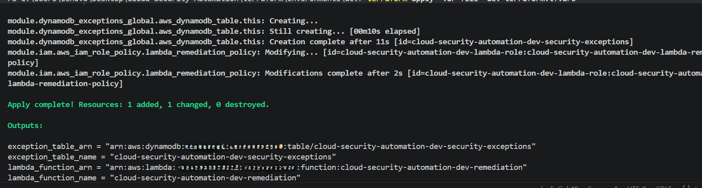

**DynamoDB is active with the `pk`/`sk` composite key, on-demand capacity, point-in-time recovery, TTL, and encryption enabled.**

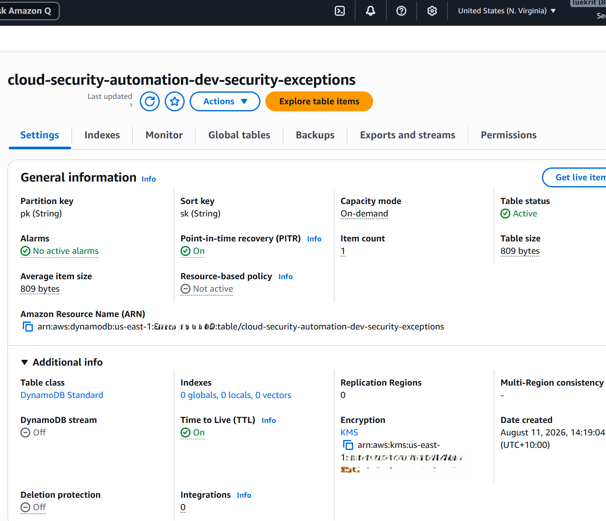

Additional configuration evidence

**The Lambda is explicitly configured for dry-run operation and the `us-east-1` exception table.**

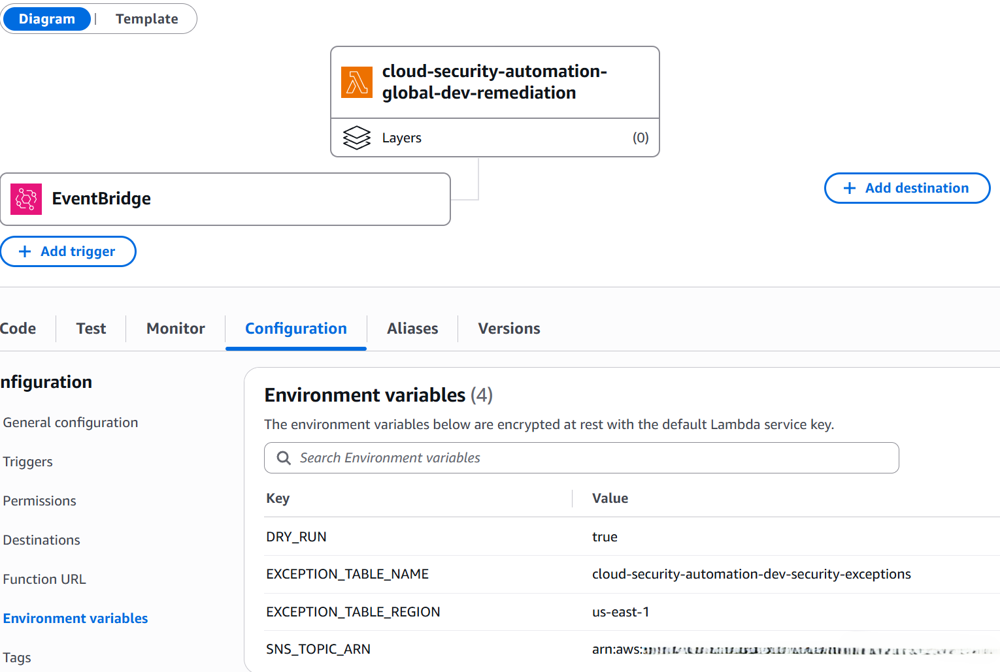

**The Lambda execution role has read-only `dynamodb:GetItem` access to the exception table.**

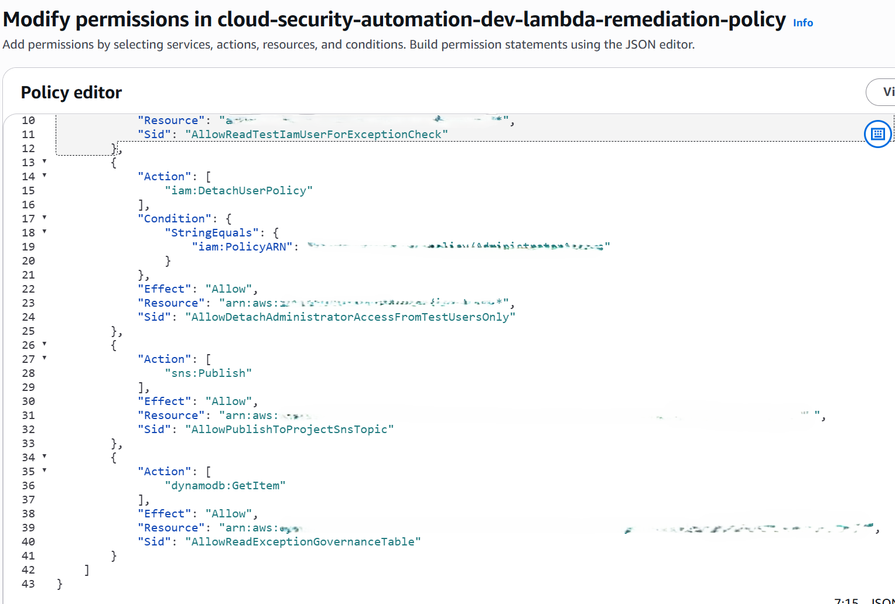

**DynamoDB TTL uses the separate retention field `ttl_delete_at_epoch`.**

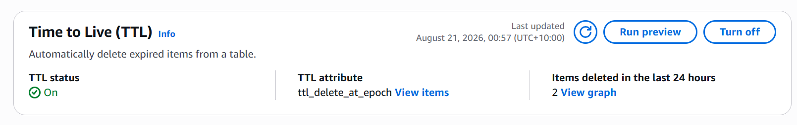

#### Governance decision evidence

**No exception record: fail closed to `REMEDIATE`; dry-run prevents the IAM mutation.**

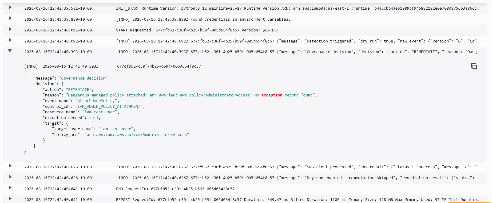

**Approved and unexpired exception: `SKIP_APPROVED` with approval and ticket context retained in the decision log.**

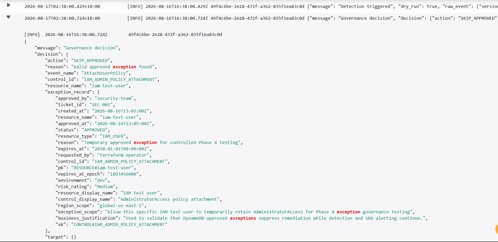

Additional decision-path evidence

**Approved exception: the action stage confirms that no remediation was performed.**

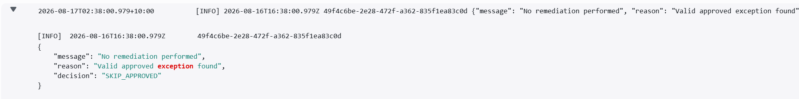

**Pending exception: a request is not an approval, so the decision remains `REMEDIATE`.**

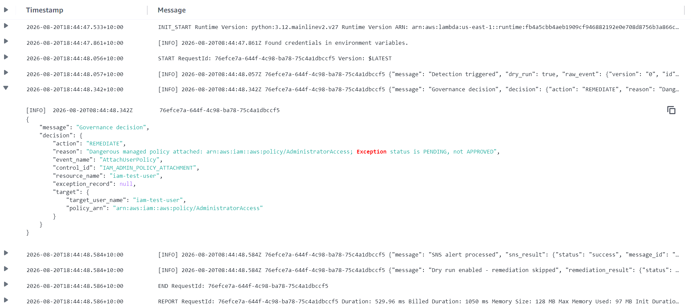

**Expired exception: read-time expiry enforcement returns `REMEDIATE`.**

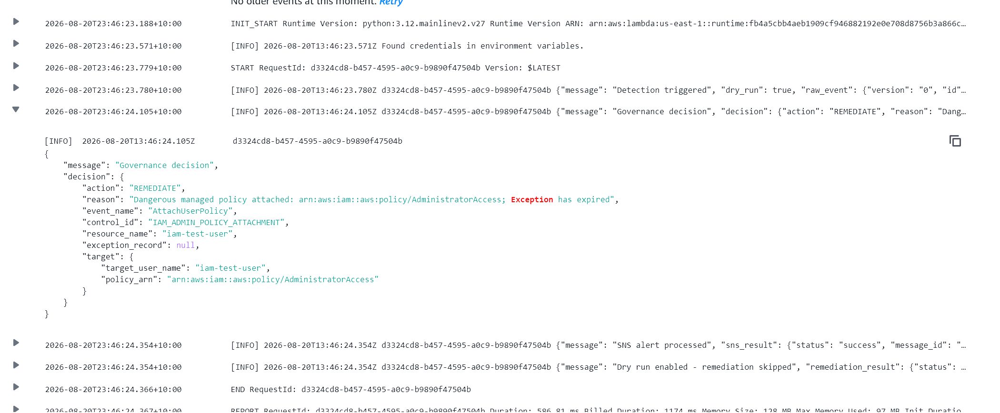

**Approval for another resource: the exact-key lookup finds no applicable record and returns `REMEDIATE`.**

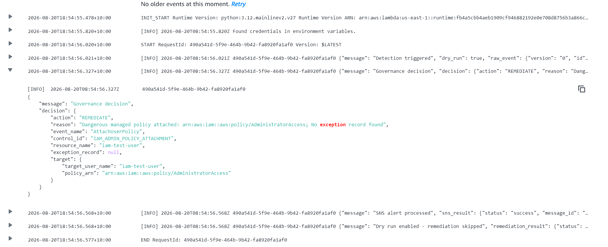

### TTL design correction

The initial expired-exception test returned "no record found" because one timestamp controlled both approval validity and DynamoDB deletion. The record could be deleted before Lambda evaluated why it was invalid.

The corrected design separates:

- `expires_at_epoch`: the security decision boundary, checked synchronously by Lambda.
- `ttl_delete_at_epoch`: delayed physical deletion after the required retention period.

This matters because DynamoDB TTL deletion is asynchronous and expired records can remain readable until the service deletes them. Security validity therefore cannot depend on physical deletion.

Phase 4.5: scanner results, hardening and validation evidence

### Phase 4.5: security validation and hardening

Phase 4.5 added security validation gates using Checkov for Terraform and Prowler for live AWS posture assessment.

### Results

| Validation | Baseline | Final |
|---|---:|---:|
| Checkov | 65 passed / 26 failed | 96 passed / 18 failed |
| Prowler targeted scan | 161 passed / 84 failed | 170 passed / 81 failed |

### Key hardening completed

- Added an SQS dead-letter queue for Lambda asynchronous failures.
- Integrated CloudTrail with CloudWatch Logs.
- Encrypted the CloudTrail CloudWatch log group with the CloudTrail customer-managed KMS key.
- Configured 365-day retention for the CloudTrail CloudWatch log group.
- Enabled root account MFA.
- Enabled account-level S3 Block Public Access.
- Restricted the Lambda execution-role trust policy with `aws:SourceAccount`.
- Runtime-tested the hardened Lambda role and confirmed successful execution and SNS publishing.
- Re-ran Prowler to validate the remediated controls.

Not every scanner finding was changed automatically. Remaining findings were reviewed and classified as deferred, contextual, accepted scope, or technical limitations.

See the full validation and finding register:

[`docs/phase-4.5-security-validation.md`](docs/phase-4.5-security-validation.md)

### Phase 4.5 validation evidence

**Final Checkov scan after IaC hardening: 96 passed / 18 reviewed findings / 0 skipped.**

**Lambda execution-role trust hardening: the Lambda role passes Prowler's confused-deputy check while the CloudTrail role remains documented for further compatibility review.**

**Final targeted Prowler assessment after remediation: 170 passed / 81 failed, down from 84 failed at baseline.**

Additional Phase 4.5 engineering evidence

**Legacy Sydney response path removed after validating the active global IAM architecture.**

**SQS dead-letter queue configuration verified. Application-error retry and DLQ delivery still require failure-path testing.**

**CloudTrail-to-CloudWatch integration verified in the deployed AWS environment.**

Historical Phase 3 test evidence

## Historical validation evidence

The following Phase 3 evidence demonstrates the original end-to-end detection and alerting pipeline. The IAM-tag exception visible in this historical test was superseded by DynamoDB governance in Phase 4.

**Unapproved attachment: CloudWatch detection and dry-run decision**

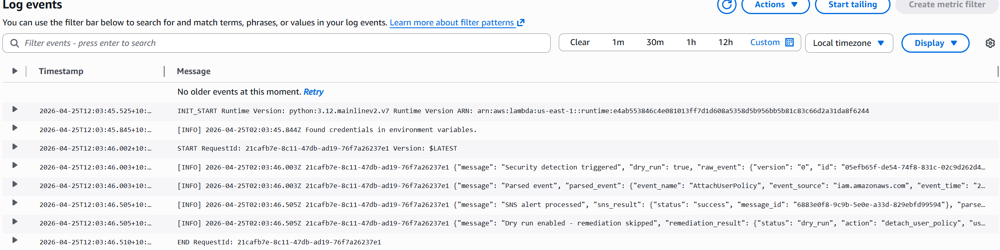

**Unapproved attachment: SNS alert showing remediation approved**

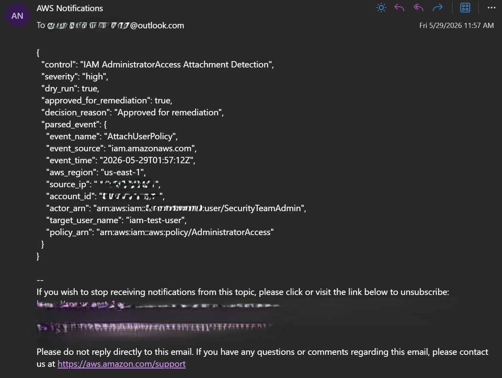

**Approved tag exception: CloudWatch decision evidence from Phase 3**

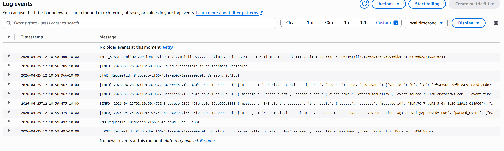

**Approved tag exception: SNS alert showing skip decision**

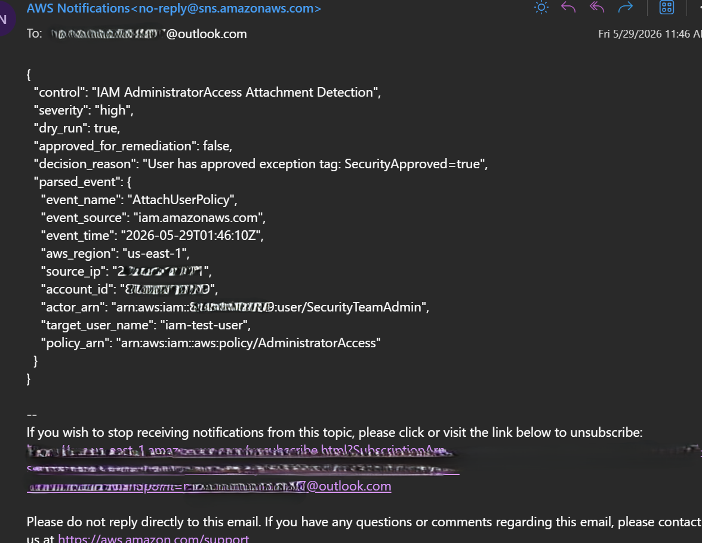

## Post-Phase 4.5 code-fix validation

- All 29 unit tests passed using mocked AWS clients.
- Terraform initialization and validation succeeded.
- Terraform applied two in-place updates: the Lambda code and its IAM policy, with no resources added or destroyed.
- Lambda reported `Active`, `Successful`, and `DRY_RUN=true`.
- Direct Lambda fixture invocations confirmed:
  - Unsupported events return `NO_ACTION`.
  - Targets outside `iam-test-*` return `NO_ACTION`.
  - Self-attachment without an exception returns `REMEDIATE` with a dry-run action.
  - SNS accepted notifications for all three scenarios.
- The asynchronous invalid-event invocation returned `202`; DLQ delivery remains unverified because queue inspection was denied.

These fixture invocations validate deployed Lambda behavior. They do not establish EventBridge delivery or actual IAM detachment. Earlier phase evidence documents the EventBridge path separately.

## Technologies

Terraform, Python, Boto3, AWS IAM, CloudTrail, EventBridge, Lambda, DynamoDB, SNS, CloudWatch Logs, S3, KMS, and GitHub.

## Next milestone

**Phase 5: AWS Security Hub integration**

- Integrate the remediation workflow with AWS Security Hub using ASFF findings.
- Add the minimum required `securityhub:BatchImportFindings` permission.
- Publish controlled findings from the existing decision engine without changing remediation behavior.
- Validate findings in Security Hub while keeping `DRY_RUN=true`.
- Retain sanitized evidence showing the event, governance decision, alert, and Security Hub finding.
